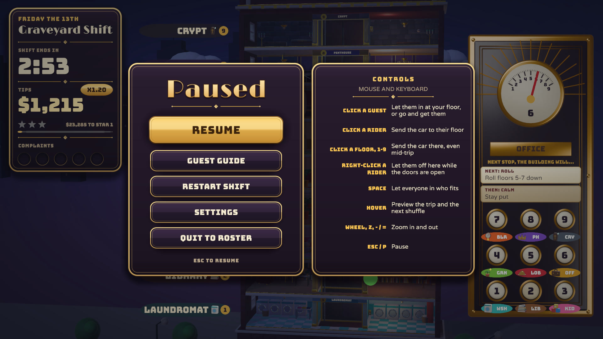

<p align="center">
  
</p>

<h1 align="center">One More Floor</h1>

<p align="center">
  <b>You run the elevator in The Shuffleton, a hotel that rearranges its floors every time you stop.</b><br>
  Get a vampire, a houseplant, a kid who pressed every button and a soaked swimmer ("Lobby, please.")
  where they're going before they run out of patience.
</p>

<p align="center">
  
  
  
  
  
  
</p>

<p align="center">
  <a href="https://nearbycoder.github.io/OneMoreFloor/"><b>Play in your browser</b></a> ·
  <a href="docs/media/trailer.mp4"><b>Watch the trailer</b></a> ·
  <a href="#play-it"><b>Play it</b></a> ·
  <a href="#how-to-play">How to play</a> ·
  <a href="#settings-and-accessibility">Settings</a> ·
  <a href="#build-from-source">Build from source</a>
</p>

## Play in your browser

**[Play One More Floor at nearbycoder.github.io/OneMoreFloor](https://nearbycoder.github.io/OneMoreFloor/)**: the
game on `main`, built for the web (WebGL 2), no install.

- **Download:** about 25 MB the first time (Brotli-compressed, unpacked by the page itself); the browser keeps it, so
  later visits start faster. The title came up in about 3 to 5 seconds from a local server on the test machine.
- **Tested** headless in Chromium 151 and Firefox 157 on Linux (AMD Radeon 8060S): loading, the title, a scripted shift
  by keyboard, sound waiting for the first click (Firefox lets Web Audio start without one by default) and then
  playing, and settings surviving a reload. Phones and tablets were tested in headless WebKit 26.6 with iPhone 15 and
  iPad Pro 11 profiles and in Chromium with a Pixel 7 profile (see below). Not tried on a real phone, Safari on a Mac,
  Windows or macOS.
- **What's different from the desktop game:** it starts at **MEDIUM** graphics fidelity (LOW to ULTRA are all in
  Settings) and renders at most 2560×1440 pixels. Progress and settings are saved in the browser (IndexedDB), separate
  from a desktop save, and clearing the site's data erases them. There's no QUIT button (close the tab). **FULLSCREEN**
  and **Alt+Enter** ask the browser for fullscreen; F11 is the browser's own, and Esc leaves fullscreen there. Sound
  starts with your first click, tap or key press, as browsers require. The music's "tape warble" in a crisis and the
  muffled sound behind menus aren't there, nor the master limiter (browsers don't run those audio filters). Mouse and
  keyboard work as on the desktop; a gamepad goes through the browser's Gamepad API and hasn't been tried in a
  browser yet.

### On a phone or tablet

Hold it sideways: the game is played in landscape, and held upright the page asks you to turn it (a running shift
pauses). On a touchscreen the page shows a few on-screen buttons during a shift, and plays by tap:

| Touch | Action |
| --- | --- |
| **Tap a guest** | Pick them: their card and their trip preview show (what hovering does with a mouse) |
| **Tap them again** | Let them in at the open car, go and get them, or take a rider to their floor |
| **Tap a floor**, then **tap it again** | Preview the trip there, then send the car |
| **Panel button** | Hold to preview the trip, let go to send the car |
| **Hold a rider** (at the open car), or pick one and tap **LET OFF** | Let them off here (the right-click) |
| **ALL IN** | Let in everyone who fits (Space) |
| **Pinch**, or the **zoom** button | The whole tower or the close-up |
| **Pause** button | Pause; every menu is played by tap |

The buttons (ALL IN and LET OFF bottom left, zoom and pause top right) light up when they have something to act on,
are at least 52 CSS pixels (points) square, and keep clear of the notch, rounded corners and home indicator; the game
itself is drawn inside the same safe area. Each finger works on its own, so a finger left on the game doesn't block a
button. They only appear on a touch-first device (a coarse pointer and no mouse or trackpad) or after a real touch, and
go away as soon as a mouse moves or a key or gamepad button is pressed; the coach's tips, the guest card and the pause
card's controls panel switch to touch wording with them. The page doesn't scroll, zoom, select text or open long-press
menus. The panel's floor buttons and the menus are the game's own UI, scaled with the screen: on a phone held sideways
a panel button answers over its whole cell, about 36×38 points (under the 44 recommended; the floors in the tower are
the bigger target), and the Settings rows are 17 to 19 points tall.

Phones get lighter defaults, as a phone browser closes a tab that uses too much memory (iOS allows a tab roughly a
gigabyte or less): **LOW** graphics (no MSAA, ambient occlusion or bloom, smaller shadow maps; Settings can raise it)
and at most two pixels per CSS pixel, 1.5 million in all (about 1700×790 on an iPhone held sideways). That cut the
game's WebGL memory (textures, buffers and render targets, most of them screen-sized) at the title from 251 to 98 MB on
the Pixel 7 profile, 187 to 91 MB on the iPhone 15 and 269 to 110 MB on the iPad Pro 11; the wasm heap stays at
217 MB. `node Tools/check-mobile.mjs --serve Builds/Pages --play` measures it and plays by touch in all three. If the
browser does close the tab, the reload notices, says so and starts at LOW with fewer pixels still; a lost WebGL context
or an out-of-memory error shows a message and a RELOAD button instead of a frozen picture.

## Trailer

<p align="center">
  <a href="docs/media/trailer.mp4"></a>
</p>

A 2:04 feature trailer (1080p30, H.264/AAC, 42.6 MB), recorded from the current game at the **ULTRA** graphics
step. It walks through every guest and shuffle card, tips and group drops, the trip preview, the gamepad close-up, the
settings card (the GRAPHICS FIDELITY slider stepping from ULTRA down to LOW and back, then LARGER TEXT), the week of shifts
with the brass elevator doors that open on each one, the time card, the Graveyard Shift and Overtime. Every frame is the
game rendering itself from scripted, seeded play, with the game's own music and sound effects and no narration. Click
the poster to open the MP4.

## About

The Shuffleton is a mid-century Art Deco hotel with a problem: **every time the elevator stops, the building
shuffles.** Two floors swap, the Penthouse rises to the top, a block of floors rolls over, and late in the week a
whole stack flips upside down. Your guests still expect to get where they're going.

You're the new operator. Board guests, send the car, and watch the forecast on your brass panel and the tags beside
the floors to see what the building will do at your next stop. Every guest has one rule that fits on an icon. A
vampire won't share the car with a mirror. A houseplant won't get off until it has had some sun, and the sun turns
vampires into bats. A courier's floor is about to leave the building. The fun is in the combinations.

Shifts last two to three minutes. You get tips, stars and a best score to chase, and a big **One More Shift** button.

- **One verb that feels good:** press a button and the car goes, with a clack, a whoosh, the needle sweeping and a
  ding. Floors lurch and settle with a puff of dust.
- **A building that misbehaves:** six kinds of shuffle card, a forecast you can plan around, and the anchor rule:
  the floor you're docked at can't move.
- **Eight guests, one rule each,** and combinations nobody planned for.
- **A week at the hotel:** ten shifts, each introducing one new guest or twist, then the Graveyard Shift, an
  endless Overtime and a daily **Today's Shift**.
- **Lounge muzak that panics:** a five-stem soundtrack that layers in strings, a ticking woodblock and a tape
  warble as guests lose patience.
- **Made to be read and played your way:** four graphics steps from LOW to ULTRA, larger text, reduced motion,
  relaxed shifts, and mouse, keyboard or gamepad with the right button names.

## Play it

**The download is older than this page.** The [latest release](https://github.com/nearbycoder/OneMoreFloor/releases/latest)
is **0.1.0** from October 4, 2026 (`OneMoreFloor-v0.1.0-linux-x86_64.zip`, 55 MB). Everything this README describes is
the game on `main`, which has had twelve rounds of work since then that aren't in any release yet: among them the late
pass and the time card's advice, auto-pause, relaxed shifts and Today's Shift, the star track and chasing your best,
the Guest Guide, the forecast tags on the floors, the pause card's controls panel, WASD, LARGER TEXT, MUTE IN
BACKGROUND, F11, GRAPHICS FIDELITY with ULTRA, the city behind the hotel, the brass doors, and bloom that actually reaches the screen. To play
that version, [build it from source](#build-from-source). The rounds are written up in
[docs/IMPROVEMENTS.md](docs/IMPROVEMENTS.md).

To run the 0.1.0 release:

```sh
unzip OneMoreFloor-v0.1.0-linux-x86_64.zip
cd OneMoreFloor-v0.1.0-linux-x86_64
./OneMoreFloor.x86_64              # add -force-wayland on a Wayland desktop if the window doesn't appear
```

### System requirements

- 64-bit Linux (x86_64) and a GPU with OpenGL 4.5 (the build uses Unity's default Linux graphics APIs; on the test
  machine it runs on OpenGL Core).
- About 150 MB of disk space for the current build (0.1.0's zip is 55 MB).
- Tested on one machine only: an AMD Radeon 8060S iGPU (Mesa radeonsi) on KDE Plasma under Wayland. Rough frame
  rates there are in the [GRAPHICS FIDELITY table](#settings-and-accessibility). No other GPU, distribution or desktop
  has been tried.
- Saves go to `~/.config/unity3d/Nearby/One More Floor/` (`save.json`, plus `save.json.bak`, the save before it).
  **F12** saves a 1920×1080 screenshot (`shot_HHMMSS.png`) to the same folder.

**macOS:** the project builds a universal (Intel and Apple silicon) app, but it hasn't been released or run on a Mac.
It's unsigned and un-notarized, so macOS blocks it at first (the zip's README.txt explains how to open it anyway).
**Windows:** the build entry point exists (`Tools/unity.sh build-windows`), but no Windows build has been made.

## How to play

Each guest has a **patience ring**. Let them in at the floor you're docked at and send the car to their floor. Tips
are fare plus whatever patience they had left, multiplied by your **streak** and by **group drops** (several guests
delivered at one stop). **Five complaints and you're fired.**

**Every stop shuffles the building** using the next card on the panel's forecast. The floor you're docked at can't
move: a card that names it **jams**, so docking somewhere is how you protect it. The car holds **four spaces**.

### Mouse and keyboard

| Input | Action |
| --- | --- |
| **Click a waiting guest** at the floor you're docked at | Let them in |
| **Space** | Let in everyone who fits |
| **Click a floor**, a **panel button**, or press **1–9** | Send the car there (you can redirect mid-trip) |
| **Click a guest in the car** | Send the car to their floor |
| **Click a guest on another floor** | Send the car to them |
| **Right-click a guest in the car** (while docked) | Let them off here to wait (for capacity and conflicts) |
| **Hover** a guest or a floor | See where they're going and preview the trip: every stop on the way, sunlight danger for vampires, sun for plants, who gets off |
| **Scroll wheel**, **Z**, **− / =** | Zoom between the whole tower and a close-up that follows the car |
| **Esc / P** | Pause (resume, guest guide, restart, settings, quit to roster) |
| **F11** or **Alt+Enter** | Fullscreen on or off (anywhere in the game) |

F11 and Alt+Enter flip the FULLSCREEN setting itself, so Settings shows it and the next launch keeps it.

The shift also pauses itself if the window loses focus or the controller you're playing with disconnects, and while the
window is in the background the game draws at most 30 frames a second and its sound fades out (the **MUTE IN
BACKGROUND** setting, on by default). Resuming counts down 3, 2, 1 over the tower before the clock runs again, so you
can find your place first. The pause card has a **controls panel** beside it with these tables, written for whatever
you're playing with (mouse and keyboard, arrow keys or WASD, or your controller's own button names). Restart and quit
ask for a second press, so a stray button can't throw a run away.

<p align="center">
  
</p>

### Gamepad (or arrow keys / WASD)

| Pad | Keys | Action |
| --- | --- | --- |
| **D-pad / left stick** up/down | **Up / Down** or **W / S** | Pick a floor (gold brackets, with the trip preview) |
| **D-pad** left/right, **LB / RB** | **Left / Right**, **A / D**, **Q / E** | Pick a guest on that floor or in the car |
| **A** | **Enter** | Send the car, let the picked guest in, or go and get them |
| **X** | **F** | Let the picked rider off here |
| **Y** | **Space** | Let everyone in |
| **B** | **Backspace** | Unpick |
| **RT / LT**, right stick | | Zoom in / out |
| **Start** | **Esc** | Pause |

A strip along the bottom says what each button will do right now. It names the buttons for the controller you're
holding: Xbox letters, PlayStation shapes (✕ ○ □ △), or Nintendo letters, with B on the bottom. The table above uses Xbox
names. Menus have a focus ring that the d-pad, stick, arrow keys and WASD move. WASD goes by key position, so on an
AZERTY keyboard it's ZQSD. The desktop game has no touch input; the browser version does (see
[On a phone or tablet](#on-a-phone-or-tablet)).

<p align="center">
  
</p>

## Features and mechanics

### The building shuffles


Every stop plays a card from the forecast queue on your panel. The first shifts only **swap** pairs of floors (and
sometimes stay **calm**). Wednesday adds **Rise** (a floor jumps to the top) and **Sink**, Thursday adds **Roll** (a
block of three rotates) and the Graveyard Shift adds **Flip** (a block of four or five reverses). The floor you're
docked at stays put, so a card that names it **jams** with sparks and a grinding noise. The floor labels beside
the tower show the next card too: a cream tag with an arrow and the slot each floor will land in, or a red **JAM**
on a named floor the car is about to dock at. The floor the tags assume you stop at is marked: a brass **STOP** on
the car's target (where the tags are exact), and a dark **STOP?** on a floor you're hovering or have picked, as a
what-if for stopping there instead. Floors also **leave the building** on a countdown, drifting off into the clouds
while another floor slides in, and the **Ocean** visits for a few stops.

### Eight guests, one rule each

| | Guest | Rule |
| --- | --- | --- |
|  | **Commuter** | Just wants their floor. |
|  | **Houseplant** | Won't get off until the doors have opened on a **sunny** floor (Greenhouse or Ocean). Wilts fast in the car. |
|  | **Mirror Mover** | Takes **two spaces**. Won't ride with a vampire. |
|  | **Vampire** | Won't ride with a mirror. If the doors open on **sunlight**, it turns into bats. |
|  | **Courier** | Their floor is **leaving the building**. Get there before the countdown runs out. |
|  | **Swimmer** | Waits on the **Ocean**, which only stays a few stops. Always "Lobby, please." |
|  | **Kid** | Pressed every button: the car **stops at every floor on the way**, sunny ones included. |
|  | **Tycoon** | **Express only.** Stop anywhere else first and the tip is gone. Pays the most. |

<table>
  <tr>
    <td width="50%"><br><sub>Sunlight and vampires don't mix.</sub></td>
    <td width="50%"><br><sub>"I need sun first!" ... "Ahh, sunshine!"</sub></td>
  </tr>
</table>

### Tips, streaks and group drops


Tips are fare plus patience left, times your **streak** (+5% per delivery, up to ×2.5; any complaint resets it)
times **group drops** (+25% for each extra guest delivered at the same stop). The last 30 seconds are **Rush Hour**,
worth ×1.5. Each stop's tips add up in a single popup, and the drop banner upgrades from DOUBLE to TRIPLE to
FULL HOUSE. Stars come from your tips, and **one star unlocks the next shift**. A star track under your tips lights
each star as you pass its target and says how much the next one needs. Once all three are lit it counts down to your
best on that shift ("$1,240 TO YOUR BEST"; today's best on Today's Shift) and calls **NEW BEST!** as you pass it. If a
shift won't give you a star, clock out on it three times and The Management gives you a **late pass** to the next one
(Overtime still needs a star on the Graveyard Shift).

### Plan every trip


Hover a guest to see who they are and where they're going. Hover a floor to preview the trip: every stop on the way
when a kid is aboard, where sunlight will hit a vampire or sun a plant, and how many guests get off.

Labels beside the tower name every floor, with its slot number, how many guests are waiting there and, when it's
leaving the building, how many stops it has left. They follow the floors as the building shuffles, and a tag on
each one says where the next card will put it (or JAM), with STOP or STOP? on the stop that assumes. The waiting
count, on the labels and on the panel's buttons, is ringed with the patience of the floor's most impatient guest:
dark while everyone is calm, amber under half, and red and pulsing when someone is about to storm off.

### Music that panics

The gameplay track is five stems that play in sync: a bossa bed, a vibraphone melody, nervous strings with a
ticking woodblock, a rush-hour percussion and horn layer, and organ and harpsichord for night shifts. A trouble meter
(the most impatient guest, complaints, a vampire near the sun, floors about to leave) fades the strings in, ducks the
melody and adds a tape warble. When you recover, it relaxes back into lounge music.

## Content overview

Ten floors: the Lobby, Office, Library, Laundromat, Boiler Room, Greenhouse ☀, Penthouse, Crypt and Daycare, plus the
**Ocean** ☀, which isn't really a floor. Behind the hotel, a city runs to the horizon, lit for each shift's time of
day from morning to night (with lit windows after dark).

| # | Shift | What's new |
| --- | --- | --- |
| 1 | Monday · First Day | Commuters and swaps. A guided first shift; the clock waits for your first drop-off. |
| 2 | Tuesday · Green Thumb | Houseplants and the Greenhouse |
| 3 | Wednesday · Heavy Lifting | Mirror Movers, the Penthouse, Rise and Sink cards |
| 4 | Thursday · Fangs for Nothing | Vampires, the Crypt, Roll cards, dusk |
| 5 | Friday · Special Delivery | Couriers, and floors that leave the building |
| 6 | Saturday · Surf's Up | The Ocean and swimmers |
| 7 | Sunday · Family Day | Kids and the Daycare |
| 8 | Monday Again · Board Meeting | Tycoons |
| 9 | Friday the 13th · Graveyard Shift | Everyone at once, Flip cards, night. Clearing it plays the ending. |
| 10 | Overtime | Endless. It keeps getting busier until five complaints. **Today's Shift** is a daily Overtime: the same building and opening guests for every run that day, with its own best. |

Clocking in (and out) closes a pair of brass elevator doors over the screen, which name the shift on the way in.
Each shift opens with a sticky note from The Management and a "New today" card, then a short scripted moment that
shows the new rule. The first time a rule matters in play, a one-line tip points at it. The **Guest Guide** (on the
pause card and the roster) lists every guest and shuffle card you've met, with its rule. At clock-out, the time card
lists what each complaint was about, with a tip for the biggest cause and how far you are from the next star.
Progress, best scores and settings are saved locally, with the previous save kept as a backup that loads if the file
is ever damaged.

## Settings and accessibility

Settings open from the title screen and the pause card:

| Setting | What it does |
| --- | --- |
| **MASTER, MUSIC, EFFECTS** | Volume sliders |
| **MUTE IN BACKGROUND** | The sound fades out while the window is in the background (on by default) |
| **FULLSCREEN** | Fullscreen or a window (also F11 / Alt+Enter). The window opens at 1600×900, or 90% of a smaller screen. |
| **GRAPHICS FIDELITY** | LOW, MEDIUM, HIGH (default) or ULTRA; see below |
| **SCREEN SHAKE** | The camera shake on shuffles (hardest on a flip), jams, departing floors, bats and the like |
| **SHUFFLE FORECAST** | The panel's forecast cards and the tags on the floor labels |
| **REDUCED MOTION** | No camera drift, push-ins or shake, floors settle without bouncing, the menus hold still, and the elevator doors become a short fade |
| **LARGER TEXT** | No text with capitals under 12 px on any screen: the HUD's, panel's and labels' small print grows by about a fifth at 1920×1080 and a third on a Steam Deck |
| **RELAXED SHIFTS** | An assist for anyone who keeps getting fired: patience lasts 1.5× longer, complaints never end the shift, and reaching the 1★ score opens the next shift (a "relaxed clear"). Relaxed runs don't save stars or best scores, and Overtime always plays standard. |

Small text is kept readable on small screens even without LARGER TEXT: below 1920×1080 the UI scales down, so text
that would come out with capitals under 9 px is drawn bigger (Valve's Steam Deck guidance). Layouts were checked at
1920×1080, 1600×900, 1440×900, 2560×1080, 1280×800 (Steam Deck size, in a window) and 1280×1024.

**GRAPHICS FIDELITY** is a four-notch slider (drag it, click a notch, or step it with the arrow keys or the d-pad). HIGH
is the default. MEDIUM and LOW turn down antialiasing, shadows, ambient occlusion, bloom and particles and, on LOW, the
render resolution, for weaker GPUs and big screens. ULTRA adds 8× MSAA, a sharper four-cascade sun shadow, soft shadows
from every floor's lamp, stronger ambient occlusion, depth of field on the far city, finer colour precision and denser
particles. The trailer and the screenshots below are ULTRA; the pause-card picture above is HIGH.

| Step | What it changes | Frame rate, 1920×1080 (load 17–38) | 2560×1440 (load 20–30) |
| --- | --- | --- | --- |
| LOW | no MSAA, 0.8 render scale, 1024 px hard shadows, no ambient occlusion, no bloom, half the particles | 49–51 fps | 51 fps |
| MEDIUM | 2× MSAA, 2048 px shadows, half-resolution 4-sample ambient occlusion, quarter-resolution bloom, 0.8× particles | 43–46 fps | 41–53 fps |
| HIGH (default) | 4× MSAA, 4096 px two-cascade soft shadows, 8-sample ambient occlusion, bloom | 47–48 fps | 38–50 fps |
| ULTRA | 8× MSAA, 8192 px four-cascade shadows, lamp shadows, 12-sample ambient occlusion, depth of field, 64-point LUT and 64-bit colour, 1.6× particles | 33–36 fps | 29–32 fps |

The frame rates are 30 s of the Graveyard Shift with vsync off on this machine's Radeon 8060S iGPU, shared with other
work (two interleaved rounds each; `Tools/fidelity.sh perf`), so treat them as rough: the same step varied by up to
1.3× between rounds, and MEDIUM and HIGH couldn't be told apart at 1920×1080, where the CPU is the limit. Captures of
one frozen moment at every step are in
[docs/media/improvements/round12](docs/media/improvements/round12/f1-fidelity-steps-graveyard.jpg).

## Screenshots

All but the pause card above are from the current build at ULTRA, taken by the trailer recorder
(`Tools/make_trailer.sh`).

| | |
| --- | --- |
|  |  |
|  |  |
|  |  |
|  |  |
|  |  |

## Build from source

**Requirements:** Unity **6000.6.2f1** (Unity 6.6) with Linux Build Support (and Mac or Windows Build Support for
those targets), Blender **4.5 LTS** on your `PATH` (only to regenerate models and audio), and `ffmpeg` (only for
the trailer and media).

```sh
git clone https://github.com/nearbycoder/OneMoreFloor.git && cd OneMoreFloor
Tools/unity.sh build-linux        # batch build -> Builds/Linux/OneMoreFloor.x86_64
Tools/play.sh                     # run it (1600x900 window, native Wayland when available)
Tools/unity.sh build-mac          # universal macOS app -> Builds/Mac/OneMoreFloor.app (unsigned)
Tools/unity.sh build-windows      # Builds/Windows/OneMoreFloor.exe (needs Windows Build Support)
Tools/release.sh                  # build Linux then macOS, and write versioned zips + .sha256 to Builds/Release
Tools/build-pages.sh              # the browser build -> Builds/Pages (index.html + .nojekyll), the GitHub Pages site
node Tools/check-pages.mjs --serve Builds/Pages --play   # test it as Pages serves it, in headless Chromium and Firefox
node Tools/check-pages.mjs https://nearbycoder.github.io/OneMoreFloor/   # the live site: exits 0 at the title, no errors
```

`Tools/release.sh` takes the version from the project settings (still 0.1.0, so it won't overwrite the published
0.1.0 zip until the version is raised), never overwrites an existing zip and uploads nothing. Set `OUT=dir` to package
somewhere else, and `SKIP_BUILD=1` to package the builds you already have.

`Tools/unity.sh` looks for the editor at `~/Unity/Hub/Editor/6000.6.2f1/Editor/Unity`; set `UNITY=/path/to/Unity`
to point it elsewhere. Or open the folder in Unity Hub and use **File → Build Profiles**. The `Main` scene holds a
single bootstrap object; everything else is built at runtime.

### Regenerating the art and audio

All models, icons, music and sound effects are committed, so this is only needed if you change a generator.

```sh
# Models (FBX into Assets/Resources/Models, .blend files into ArtSource/blend)
blender -b -P ArtSource/build_floors.py       [-- --only Lobby,Ocean --preview /tmp/prev]
blender -b -P ArtSource/build_characters.py   [-- --only Kid --pose-preview /tmp/poses]   # rigged and animated
blender -b -P ArtSource/build_props.py
blender -b -P ArtSource/build_panel.py
blender -b -P ArtSource/build_icons.py

# Audio (WAVs into Assets/Resources/Audio/{Sfx,Music}; Blender's bundled Python has numpy)
blender -b --python-exit-code 1 -P Tools/synth/make_audio.py -- [sfx] [music]
blender -b --python-exit-code 1 -P Tools/synth/audit.py          # objective checks on every sound

# Project setup (player settings, URP, fonts, scene) after a fresh clone or a Unity upgrade
Tools/unity.sh batch OneMoreFloor.EditorTools.ProjectSetup.Apply
```

### Tests and validators

```sh
Tools/unity.sh test        # EditMode tests: every rule, determinism, a random-input fuzz, every shift beatable
Tools/sim.sh fuzz          # the rules on .NET outside Unity: random commands against every shift, invariants checked,
                           # and every stop lands the floors where the labels' forecast tags said
Tools/sim.sh balance       # four bot skill levels play every shift (also: human, stars, pace, causes, relaxed)
Tools/autopilot.sh         # plays all ten shifts in the built game (each timed one to the bell, about 15 minutes),
                           # then drives the menus with a virtual gamepad and a virtual keyboard and runs the flow
                           # checks (late pass, time card, auto-pause, pad glyphs, arrow keys, WASD and Esc, settings and
                           # every GRAPHICS FIDELITY step by mouse, keys and pad, the screen doors, patience badges, guest
                           # guide, restart and quit confirmation, the pause card's controls panel, STOP markers, the
                           # resume count, the close-up's edge alerts, the star track's chase of a seeded best, MUTE IN
                           # BACKGROUND read off the final mix, a real alt-tab and F11 / Alt+Enter (those two only inside
                           # the nested KWin), a click at the centre of every control on every menu); every frame of every
                           # shift is also checked: reward popups never overlap (and flying coins never draw over them),
                           # the HUD's star track agrees with the score, the forecast tags agree with the rules (and floors
                           # land where they said), the coach tip never covers a floor label (tips are reset before each
                           # shift so every shift's tips get measured), and a shift banner (ON THE CLOCK!, RUSH HOUR!...)
                           # never covers the HUD card or the panel
Tools/autopilot.sh out ui  # just the flow checks (a few minutes)
Tools/autopilot.sh out text   # the text audit: every visible text's capital height in pixels and any that spill out
                              # of its box or card, on the title, roster, intro, play, pause, guide, settings and time card
OMF_SIZE=1280x800 Tools/autopilot.sh out text   # the same at another window size (Steam Deck here)
Tools/autopilot.sh out text-large                # the text audit with LARGER TEXT on (a 12 px floor)
OMF_LARGE_TEXT=1 Tools/autopilot.sh out 8        # any run with LARGER TEXT on (here the Graveyard Shift)
Tools/fidelity.sh shots out 8   # one frozen moment of a shift at every GRAPHICS FIDELITY step (tower and close-up)
Tools/fidelity.sh perf out 8    # frame times per step, interleaved, plus HIGH without the city (OMF_SIZE, OMF_ROUNDS)
```

The autopilot runs the game inside a private nested KWin (`Tools/nested.sh`: its own Wayland socket, D-Bus session and
scratch config folder), so its window never opens on your desktop and the real mouse can't reach it. `OMF_NESTED=0`
runs it on the desktop instead, and machines without KWin fall back to that (the alt-tab and fullscreen checks then
print SKIP). For the alt-tab check, `nested.sh` opens a `kdialog` box inside the nested desktop at the game's request
and closes it again. When the session ends it stops anything still running on its private D-Bus bus (apps start
helpers like `xdg-desktop-portal-kde` and `ksecretd` there, which would otherwise outlive it) and says what it stopped.

### Trailer and README media

```sh
Tools/make_trailer.sh                  # records every shot from the built game, then cuts docs/media/trailer.mp4,
                                       # the poster, the teaser GIF and the screenshots (about 40 minutes at ULTRA here)
Tools/make_trailer.sh capture video    # one capture pass (video, or audio); `assemble` re-cuts an existing capture
Tools/make_trailer.sh capture audio plant,pad   # re-record only these shots' sound and splice them in
Tools/make_trailer.sh stills           # only the README screenshots
OMF_FIDELITY=2 Tools/make_trailer.sh   # record at another GRAPHICS FIDELITY step (0 LOW .. 3 ULTRA, default 3)
```

Every pass runs in a 1920×1080 window inside the nested KWin, and automation runs (`autopilot.sh`, `demo.sh`,
`make_trailer.sh`) point `XDG_CONFIG_HOME` at the gitignored `Logs/xdg` (or the nested KWin's scratch folder), so they
never touch your save or Unity's prefs in `~/.config/unity3d`.

`TrailerReel` (in the game) plays each shot from a fixed seed, skips ahead to a moment it found by playing the same
seed headlessly, and records it twice: once rendered offline at a locked 30 fps (so ULTRA costs render time, not frame
rate), and once in real time to capture the sound. The real-time pass's own output stream is muted on the sound server
while the game's final mix is recorded inside the game, so it isn't heard on the machine. Because that pass runs in
real time, a frame longer than the game's 0.25 s step limit leaves the game (and its sounds) behind the video; the pass
logs how much and from when for each shot in `audio_shots.txt`, so those shots can be re-recorded. `Tools/trailer/build.py` cuts
the shots on the beat of the game's 104 BPM track, mixes the music bed from the game's own stems with ducking under the
effects, and encodes the result.

## Project structure

```
Assets/
  Scripts/Core/          the game rules in plain C# (no UnityEngine): building and shuffle cards, car motion,
                         passengers, scoring, the spawn director, scripted openings, the bot player
  Scripts/Game/          presentation: GameRoot (bootstrap and flow), ShiftRunner (sim -> views, input),
                         building/floor/car/passenger views, CharacterRig (Playables), CameraRig, Controls, Sky, Fx,
                         GraphicsQuality (the fidelity steps)
  Scripts/Game/UI/       HUD, operator panel, speech bubbles, coach tips, menus, screen doors, the Art Deco painter (Deco)
  Scripts/Game/Audio/    AudioDirector (synced stems, the reactive mix, pooled effects), MasterLimiter
  Scripts/Game/Automation/
                         AutoPilot (self-test), PadSim and KeySim (virtual gamepad and keyboard), DemoReel and
                         TrailerReel (recordings), AudioTap (records the final mix), PerfProbe, FidelityShots, TextAudit
  Tests/EditMode/        rules tests, determinism, "every shift is beatable", fuzz
  Editor/                ProjectSetup, BuildScript, import settings
  Resources/             Models (FBX), Icons, Audio, Fonts (OFL), template materials
ArtSource/               Blender generators (bpy) and the .blend files they write
Tools/
  unity.sh, play.sh      editor launcher (build, test, batch) and the build runner
  nested.sh              a private nested KWin for test and capture windows
  synth/                 the audio synthesizer (numpy) and audit.py
  simharness/, sim.sh    the rules harness on .NET: balance tables, star thresholds, traces, fuzz
  trailer/, make_trailer.sh, demo.sh
                         trailer and demo recording
  autopilot.sh, fidelity.sh, uicheck.sh, gallery.sh, shot.sh
                         built-game self-test, fidelity captures and timing, menu hit-testing, screenshots
  playtest_report.py     summarises local playtest logs and suggests star thresholds
docs/
  PLAN.md                the design and technical plan
  BRIEF.md               the original brief
  IMPROVEMENTS.md        the twelve improvement rounds since 0.1.0: plans, results and what's still open
  media/                 trailer, poster, teaser, screenshots and each round's captures
```

## Tech highlights

- **A deterministic rules core.** `ShiftSim` is plain C# with no Unity dependency. It steps on a fixed 1/60 s clock
  from a seed, owns all the timing that matters (car motion, doors, patience), and raises events that the views
  animate. The game, the bot, the tests, the balance harness and the trailer recorder all drive the same object.
- **Balanced against a model of a person.** `Tools/sim.sh human` plays every shift with a human model: decision
  time, Fitts'-law pointer travel for every click, and a beat to take in each stop, at three skill levels. Star
  thresholds come from its score percentiles, so about half of first attempts earn the star that unlocks the next
  shift, and spawn pacing is set so that modelled new players are fired on at most about one run in five
  (`Tools/sim.sh pace`, `causes`). Real playtests append to a local log that `Tools/playtest_report.py` turns into new thresholds.
- **Every model is a script.** `ArtSource/*.py` builds the ten floors, nine characters, the car, panel and props in
  Blender from primitives, with a material-name convention that `ModelLibrary` turns into URP materials at runtime.
  The characters have real armatures with keyframed clips (idle, walk, stomp, tap, cheer, tuck, fume) that
  `CharacterRig` blends with Playables, plus code-driven squash, stretch and secondary motion.
- **Every sound is synthesized.** `Tools/synth` renders the music stems and about 100 effects and "animalese" voices
  with numpy. `audit.py` checks them objectively: BS.1770 loudness, 4× oversampled true peak, DC, clicks, loop
  seams, leading silence, spectral balance, and every effect at the volume the game plays it.
- **Reactive music, sample-locked.** The five stems start on the same DSP tick and share one pitch, so the tape
  warble can bend them without drift. A lookahead limiter on the master holds the peak.
- **Graphics steps without touching the project.** GRAPHICS FIDELITY changes a runtime copy of the URP pipeline and
  picks among renderer assets per step, so the build keeps every shader variant it needs and the shipped asset never
  changes.
- **Verification in the built game.** `AutoPilot` plays all ten shifts with the bot through the full presentation,
  fails on any logged exception, and drives the menus and a shift with a virtual Input System gamepad and keyboard.
- **A trailer recorded by the game.** `TrailerReel` scripts each shot through the same fixed step as the bot, so
  an offline 30 fps video pass and a real-time audio pass play out identically and line up when muxed.

## Credits and tooling

Design, code, models, music and sound were made for this project.

| What | Source | License |
| --- | --- | --- |
| [Limelight](https://fonts.google.com/specimen/Limelight) (display type) | Sorkin Type | SIL OFL 1.1 ([text](Assets/Resources/Fonts/OFL-limelight.txt)) |
| [Bungee](https://github.com/djrrb/Bungee) (signage) | David Jonathan Ross | SIL OFL 1.1 ([text](Assets/Resources/Fonts/OFL-bungee.txt)) |
| [Varela Round](https://fonts.google.com/specimen/Varela+Round) (body text) | Joe Prince | SIL OFL 1.1 ([text](Assets/Resources/Fonts/OFL-varelaround.txt)) |
| [Patrick Hand](https://fonts.google.com/specimen/Patrick+Hand) (sticky notes) | Patrick Wagesreiter | SIL OFL 1.1 ([text](Assets/Resources/Fonts/OFL-patrickhand.txt)) |
| Liberation Sans (TextMesh Pro's default fallback) | Red Hat | SIL OFL 1.1 ([text](<Assets/TextMesh Pro/Fonts/LiberationSans - OFL.txt>)) |
| TextMesh Pro essential resources (shaders, settings) | Unity Technologies | Unity Companion License |
| Unity packages (URP, Input System, uGUI, Test Framework) | Unity Technologies | Unity Companion License, resolved by the Package Manager (not vendored) |

Built with Unity 6.6 (URP), Blender 4.5, Python and numpy (inside Blender), .NET, and ffmpeg for the trailer.

## Status and known issues

The full scope is in (ten floors, eight guests, ten shifts, Overtime and Today's Shift, menus, saves, settings,
gamepad support), and it passed its automated checks after the last gameplay change (round 12: EditMode 69/69,
`sim.sh fuzz`, and 180 autopilot checks across all ten shifts in the built game). The only release is still **0.1.0**
from launch day; a version bump and a new release are the owner's call. What each improvement round changed, how it
was checked, and what it left open is in [docs/IMPROVEMENTS.md](docs/IMPROVEMENTS.md). Honest caveats:

- **No human playtests yet.** Difficulty and star thresholds are fitted to a model of a player, not real people.
  The model is grounded in standard human-factors numbers, but it plays smarter than a first-timer. The local
  playtest log is there so the first real sessions can correct it. The late pass (three tries opens the next
  shift) is the safety net until then. Relaxed shifts (1.5× patience, no firing) are tuned the same way: modelled
  new players are never fired and reach the 1★ score on 59–96% of shifts, but no person has tried them.
- **Nothing since 0.1.0 has been played by a person.** Everything rounds 1–12 added was checked by the autopilot, unit
  tests and screenshots only. Open questions for a player or the owner: whether the forecast tags help or clutter the
  labels and whether STOP? reads as a what-if, whether the resume count helps or holds you up, whether LOW's softer
  text (its 0.8 render scale also draws the HUD) is acceptable, the defaults of LARGER TEXT and MUTE IN BACKGROUND,
  whether ULTRA is worth its cost, whether the city competes with the hotel, and whether the doors still feel quick on
  the hundredth shift. The background behaviour (pause, 30 fps, the mix fading out) and F11 / Alt+Enter are tested
  inside a private nested KWin, not with a person's alt-tab on a real desktop or on other compositors.
- **The audio has been measured, not listened to critically.** Every sound passes the objective audit (loudness,
  peaks, clicks, seams, balance), but nobody has judged how it sounds on the hundredth play.
- **Gamepad support is tested with virtual pads.** Every path runs through the Input System in the autopilot, but
  no physical controller has been tried. Prompts switch to PlayStation or Nintendo names for virtual DualShock 4
  and Switch Pro devices. A real pad that Linux reports as a generic device is recognized by its product name
  ("Sony", "DualSense", "Nintendo", ...), which hasn't been tried with hardware. Anything unrecognized gets Xbox
  names. AZERTY (ZQSD) hasn't been tried on a real keyboard.
- **Frame rate is measured on one shared machine.** See the GRAPHICS FIDELITY table above: on the Radeon 8060S iGPU,
  shared with other work, no step averaged under 29 fps at 1920×1080 or 2560×1440, and fullscreen at this display's
  3072×1728 ran at about 60 fps on HIGH in round 7 (before bloom reached the screen). No other GPU has been tried.
- **Simple rigs.** Characters have armatures with elbows and knees, but no facial rigs or fingers. Props held in
  hand (the courier's parcel, the mirror, the kid's balloons) lock that arm.
- **Guests are small at full zoom-out.** Play frames the tower more tightly than the menus do (floors 116 px apart at
  1080p, or 112 px with the gamepad prompt strip showing), so guests are about 60–75 px tall, and the close-up zoom
  roughly doubles that. Drawing guests bigger was tried and dropped: a full car pushes heads up to its ceiling, so it
  would mean re-proportioning the floors or showing fewer at once, which is a design decision. On a 5:4 screen the
  tower is fitted to the narrower strip between the labels and the panel, so floors are only about 53 px apart at
  1280×1024 (about 75 px at the Deck's size). Small-screen layouts were checked in windows, not on a real Deck or 5:4
  monitor. With LARGER TEXT on a small screen a few labels use shorter words ("$20,660 TO GO", "NEXT STOP, THE
  HOTEL..."), and the panel dial's scale numbers keep the default size, as they'd crowd each other.
- **Linux is the only released platform.** A universal macOS app builds (both architectures confirmed with `file`,
  bundle id `com.nearbycoder.onemorefloor`), but it has never been run on a Mac, and it's unsigned and
  un-notarized. No Windows build has been made: this machine's editor doesn't have Windows Build Support.
- **No license yet.** One hasn't been chosen, so the default "all rights reserved" applies until a `LICENSE` file
  is added. The fonts keep their own OFL licenses.
