<p align="center">
  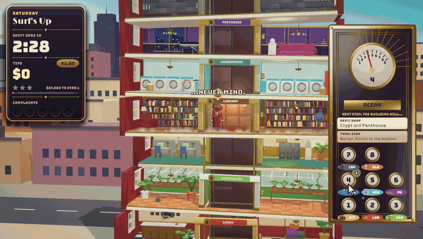
</p>

<h1 align="center">One More Floor</h1>

<p align="center">
  <b>You run the elevator in The Shuffleton, a hotel that rearranges its floors every time you stop.</b><br>
  Get a vampire, a houseplant, a kid who pressed every button and a soaked swimmer ("Lobby, please.")
  where they're going before they run out of patience.
</p>

<p align="center">
  
  
  
  
  
  
</p>

<p align="center">
  <a href="https://github.com/nearbycoder/OneMoreFloor/releases/latest"><b>Download for Linux</b></a> ·
  <a href="docs/media/trailer.mp4"><b>Watch the trailer</b></a> ·
  <a href="#how-to-play">How to play</a> ·
  <a href="#build-from-source">Build from source</a>
</p>

## Trailer

<p align="center">
  <a href="docs/media/trailer.mp4">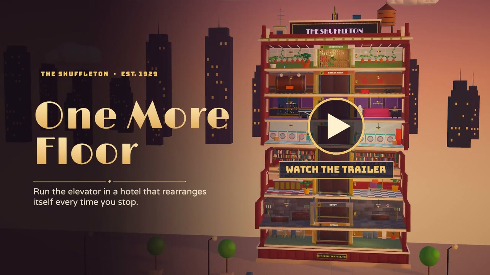</a>
</p>

A 1:56 feature trailer (1080p30, H.264/AAC, 37 MB) that walks through every guest, every shuffle card, the
reactive music, the week of shifts and the endless Overtime. It's cut from scripted gameplay recorded by the game
itself, with the game's own music and sound. Click the poster to open the MP4.

## About

The Shuffleton is a mid-century Art Deco hotel with a problem: **every time the elevator stops, the building
shuffles.** Two floors swap, the Penthouse rises to the top, a block of floors rolls over, and late in the week a
whole stack flips upside down. Your guests still expect to get where they're going.

You're the new operator. Board guests, send the car, and watch the forecast on your brass panel to see what the
building will do at your next stop. Every guest has one rule that fits on an icon. A vampire won't share the car with
a mirror. A houseplant won't get off until it has had some sun, and the sun turns vampires into bats. A courier's
floor is about to leave the building. The fun is in the combinations.

Shifts last two to three minutes. You get tips, stars and a best score, and a big **One More Shift** button.

- **One verb that feels good:** press a button and the car goes, with a clack, a whoosh, the needle sweeping and a
  ding. Floors lurch and settle with a puff of dust.
- **A building that misbehaves:** six kinds of shuffle card, a forecast you can plan around, and the anchor rule:
  the floor you're docked at can't move.
- **Eight guests, one rule each,** and combinations nobody planned for.
- **A week at the hotel:** ten shifts, each introducing one new guest or twist, then the Graveyard Shift and an
  endless Overtime.
- **Lounge muzak that panics:** a five-stem soundtrack that layers in strings, a ticking woodblock and a tape
  warble as guests lose patience.

## How to play

Each guest has a **patience ring**. Let them in at the floor you're docked at and send the car to their floor. Tips
are fare plus whatever patience they had left, multiplied by your **streak** and by **group drops** (several guests
delivered at one stop). **Five complaints and you're fired.**

**Every stop shuffles the building** using the next card on the panel's forecast. The floor you're docked at can't
move: a card that names it **jams**, so docking somewhere is how you protect it. The car holds **four spaces**.

### Mouse and keyboard

| Input | Action |
| --- | --- |
| **Click a waiting guest** at the floor you're docked at | Let them in |
| **Space** | Let in everyone who fits |
| **Click a floor**, a **panel button**, or press **1–9** | Send the car there (you can redirect mid-trip) |
| **Click a guest in the car** | Send the car to their floor |
| **Click a guest on another floor** | Send the car to them |
| **Right-click a guest in the car** (while docked) | Let them off here to wait (for capacity and conflicts) |
| **Hover** a guest or a floor | See where they're going and preview the trip: every stop on the way, sunlight danger for vampires, sun for plants, who gets off |
| **Scroll wheel**, **Z**, **− / =** | Zoom between the whole tower and a close-up that follows the car |
| **Esc / P** | Pause (resume, restart, settings, quit to roster) |

### Gamepad (or arrow keys)

| Pad | Keys | Action |
| --- | --- | --- |
| **D-pad / left stick** up/down | **Up / Down** | Pick a floor (gold brackets, with the trip preview) |
| **D-pad** left/right, **LB / RB** | **Left / Right**, **Q / E** | Pick a guest on that floor or in the car |
| **A** | **Enter** | Send the car, let the picked guest in, or go and get them |
| **X** | **F** | Let the picked rider off here |
| **Y** | **Space** | Let everyone in |
| **B** | **Backspace** | Unpick |
| **RT / LT**, right stick | | Zoom in / out |
| **Start** | **Esc** | Pause |

A strip along the bottom says what each button will do right now. Menus have a focus ring that the d-pad, stick
and arrow keys move.

<p align="center">
  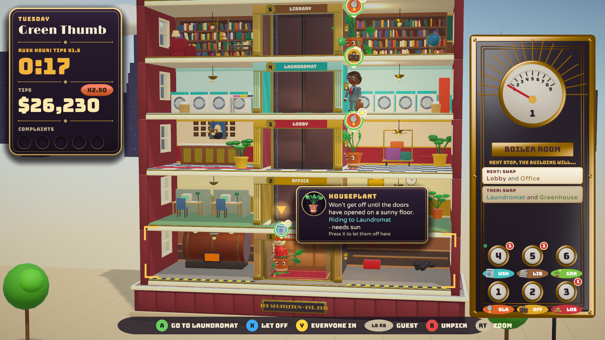
</p>

## Features and mechanics

### The building shuffles

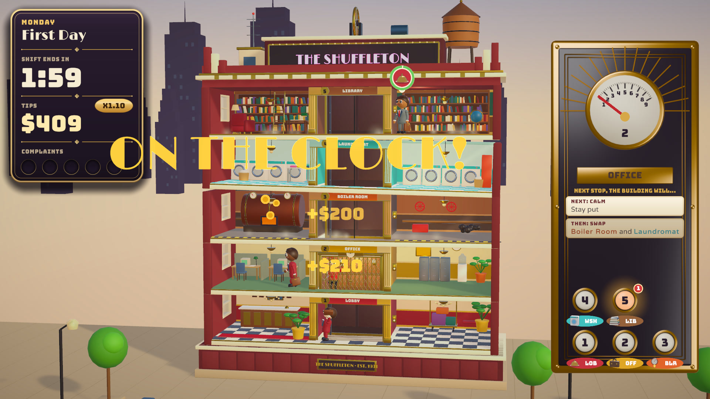

Every stop plays a card from the forecast queue on your panel. The first shifts only **swap** pairs of floors (and
sometimes stay **calm**). Wednesday adds **Rise** (a floor jumps to the top) and **Sink**, Thursday adds **Roll** (a
block of three rotates) and the Graveyard Shift adds **Flip** (a block of four or five reverses). The floor you're
docked at stays put, so a card that names it **jams** with sparks and a grinding noise. Floors also **leave the
building** on a countdown, drifting off into the clouds while another floor slides in, and the **Ocean** visits for
a few stops.

### Eight guests, one rule each

| | Guest | Rule |
| --- | --- | --- |
|  | **Commuter** | Just wants their floor. |
|  | **Houseplant** | Won't get off until the doors have opened on a **sunny** floor (Greenhouse or Ocean). Wilts fast in the car. |
| 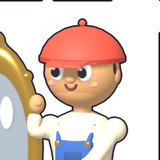 | **Mirror Mover** | Takes **two spaces**. Won't ride with a vampire. |
| 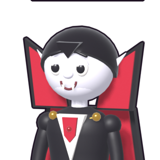 | **Vampire** | Won't ride with a mirror. If the doors open on **sunlight**, it turns into bats. |
| 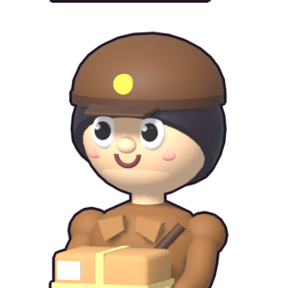 | **Courier** | Their floor is **leaving the building**. Get there before the countdown runs out. |
| 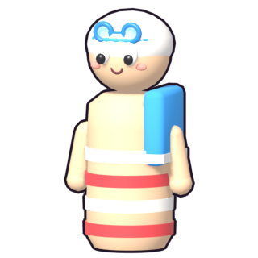 | **Swimmer** | Waits on the **Ocean**, which only stays a few stops. Always "Lobby, please." |
| 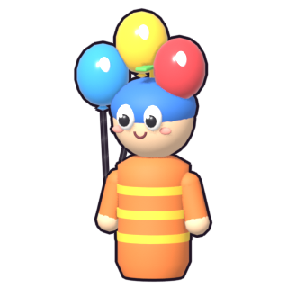 | **Kid** | Pressed every button: the car **stops at every floor on the way**, sunny ones included. |
| 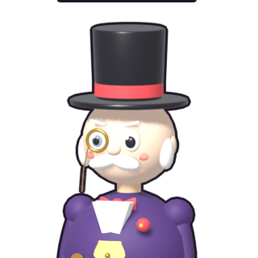 | **Tycoon** | **Express only.** Stop anywhere else first and the tip is gone. Pays the most. |

<table>
  <tr>
    <td width="50%">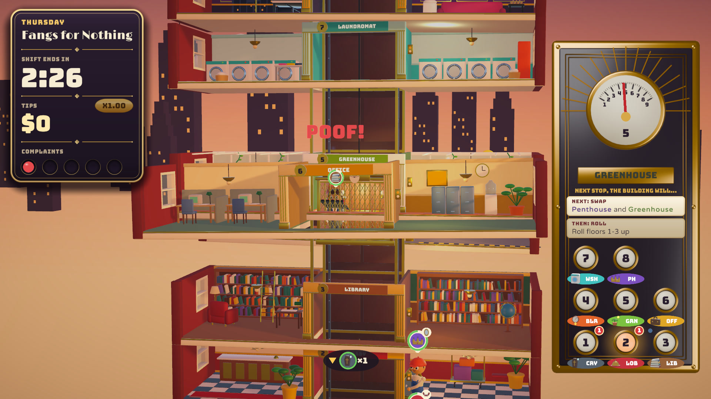<br><sub>Sunlight and vampires don't mix.</sub></td>
    <td width="50%">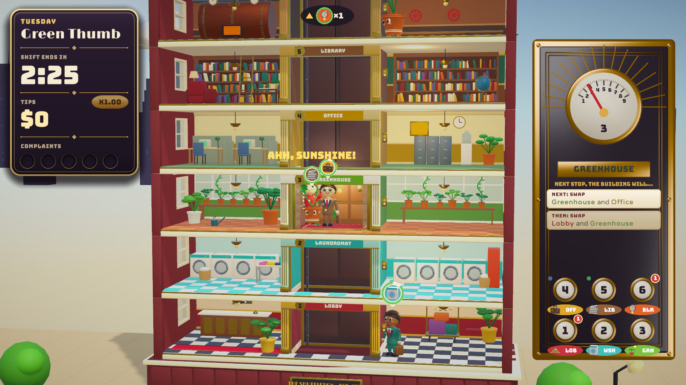<br><sub>"I need sun first!" ... "Ahh, sunshine!"</sub></td>
  </tr>
</table>

### Tips, streaks and group drops

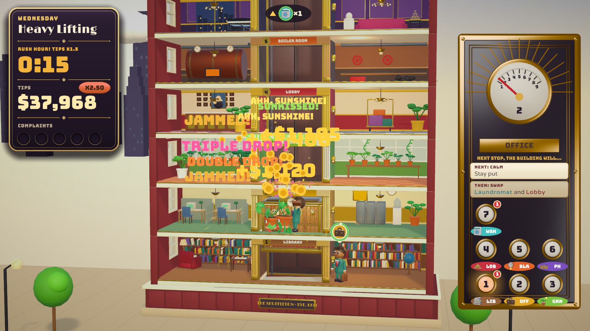

Tips are fare plus patience left, times your **streak** (+5% per delivery, up to ×2.5; any complaint resets it)
times **group drops** (+25% for each extra guest delivered at the same stop). The last 30 seconds are **Rush Hour**,
worth ×1.5. Stars come from your tips, and **one star unlocks the next shift**.

### Plan every trip

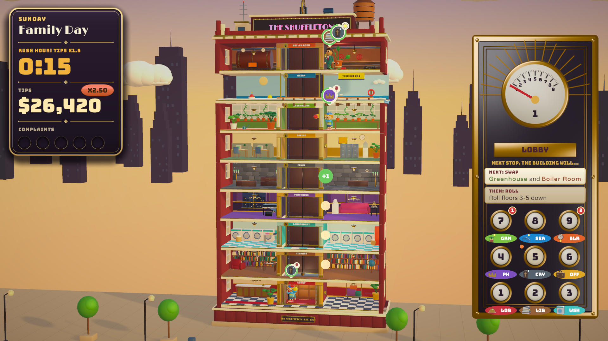

Hover a guest to see who they are and where they're going. Hover a floor to preview the trip: every stop on the way
when a kid is aboard, where sunlight will hit a vampire or sun a plant, and how many guests get off.

### Music that panics

The gameplay track is five stems that play in sync: a bossa bed, a vibraphone melody, nervous strings with a
ticking woodblock, a rush-hour percussion and horn layer, and organ and harpsichord for night shifts. A trouble meter
(the most impatient guest, complaints, a vampire near the sun, floors about to leave) fades the strings in, ducks the
melody and adds a tape warble. When you recover, it relaxes back into lounge music.

## Content overview

Ten floors: the Lobby, Office, Library, Laundromat, Boiler Room, Greenhouse ☀, Penthouse, Crypt and Daycare, plus the
**Ocean** ☀, which isn't really a floor.

| # | Shift | What's new |
| --- | --- | --- |
| 1 | Monday · First Day | Commuters and swaps. A guided first shift; the clock waits for your first drop-off. |
| 2 | Tuesday · Green Thumb | Houseplants and the Greenhouse |
| 3 | Wednesday · Heavy Lifting | Mirror Movers, the Penthouse, Rise and Sink cards |
| 4 | Thursday · Fangs for Nothing | Vampires, the Crypt, Roll cards, dusk |
| 5 | Friday · Special Delivery | Couriers, and floors that leave the building |
| 6 | Saturday · Surf's Up | The Ocean and swimmers |
| 7 | Sunday · Family Day | Kids and the Daycare |
| 8 | Monday Again · Board Meeting | Tycoons |
| 9 | Friday the 13th · Graveyard Shift | Everyone at once, Flip cards, night. Clearing it plays the ending. |
| 10 | Overtime | Endless. It keeps getting busier until five complaints. |

Each shift opens with a sticky note from The Management and a "New today" card, then a short scripted moment that
shows the new rule. The first time a rule matters in play, a one-line tip points at it. Progress, best scores and
settings are saved locally.

## Screenshots

| | |
| --- | --- |
| 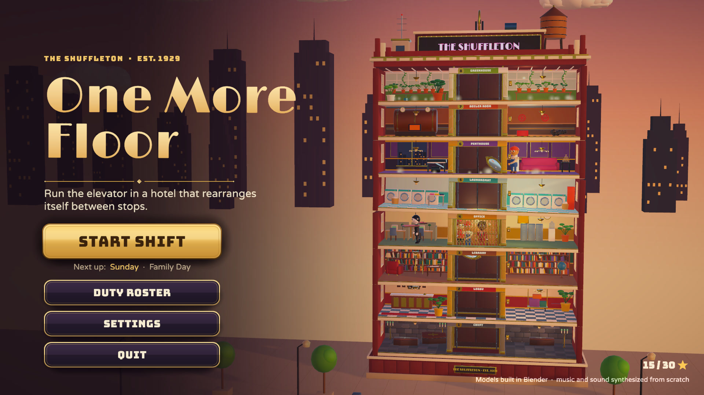 | 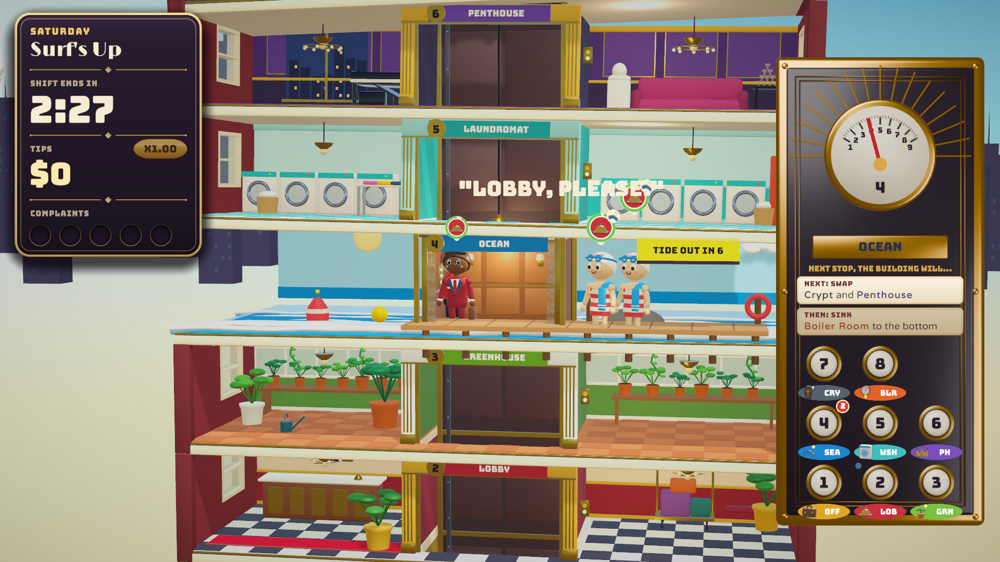 |
|  |  |
|  |  |
| 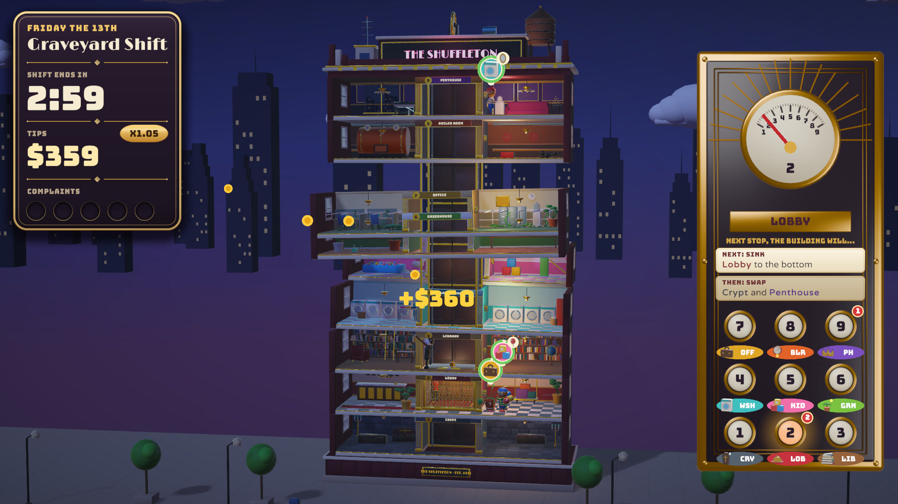 |  |
|  | 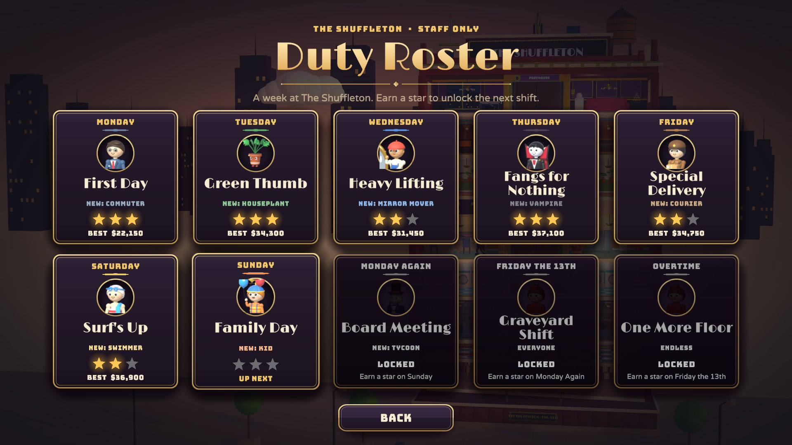 |

## Play it

Download `OneMoreFloor-v0.1.0-linux-x86_64.zip` from the
[latest release](https://github.com/nearbycoder/OneMoreFloor/releases/latest), unzip it and run:

```sh
unzip OneMoreFloor-v0.1.0-linux-x86_64.zip
cd OneMoreFloor-v0.1.0-linux-x86_64
./OneMoreFloor.x86_64              # add -force-wayland on a Wayland desktop if the window doesn't appear
```

It needs 64-bit Linux with a Vulkan- or OpenGL 4.5-capable GPU. Saves go to
`~/.config/unity3d/Nearby/One More Floor/`. There are no Windows or macOS builds yet, but the Unity project builds
for them (see below).

## Build from source

**Requirements:** Unity **6000.6.2f1** (Unity 6.6) with Linux Build Support, Blender **4.5 LTS** on your `PATH`
(only to regenerate models and audio), and `ffmpeg` (only for the trailer and media).

```sh
git clone https://github.com/nearbycoder/OneMoreFloor.git && cd OneMoreFloor
Tools/unity.sh build-linux        # batch build -> Builds/Linux/OneMoreFloor.x86_64
Tools/play.sh                     # run it (1600x900 window, native Wayland when available)
```

`Tools/unity.sh` looks for the editor at `~/Unity/Hub/Editor/6000.6.2f1/Editor/Unity`; set `UNITY=/path/to/Unity`
to point it elsewhere. Or open the folder in Unity Hub and use **File → Build Profiles**. The `Main` scene holds a
single bootstrap object; everything else is built at runtime.

### Regenerating the art and audio

All models, icons, music and sound effects are committed, so this is only needed if you change a generator.

```sh
# Models (FBX into Assets/Resources/Models, .blend files into ArtSource/blend)
blender -b -P ArtSource/build_floors.py       [-- --only Lobby,Ocean --preview /tmp/prev]
blender -b -P ArtSource/build_characters.py   [-- --only Kid --pose-preview /tmp/poses]   # rigged and animated
blender -b -P ArtSource/build_props.py
blender -b -P ArtSource/build_panel.py
blender -b -P ArtSource/build_icons.py

# Audio (WAVs into Assets/Resources/Audio/{Sfx,Music}; Blender's bundled Python has numpy)
blender -b --python-exit-code 1 -P Tools/synth/make_audio.py -- [sfx] [music]
blender -b --python-exit-code 1 -P Tools/synth/audit.py          # objective checks on every sound

# Project setup (player settings, URP, fonts, scene) after a fresh clone or a Unity upgrade
Tools/unity.sh batch OneMoreFloor.EditorTools.ProjectSetup.Apply
```

### Tests and validators

```sh
Tools/unity.sh test        # EditMode tests: every rule, determinism, a random-input fuzz, every shift beatable
Tools/sim.sh fuzz          # the rules on .NET outside Unity: random commands against every shift, invariants checked
Tools/sim.sh balance       # four bot skill levels play every shift (also: human, stars, pace, causes)
Tools/autopilot.sh         # plays all ten shifts in the built game, then drives the menus with a virtual gamepad
```

### Trailer and README media

```sh
Tools/make_trailer.sh      # records every shot from the built game, then cuts docs/media/trailer.mp4,
                           # the poster, the teaser GIF and the screenshots (about 15 minutes)
```

`TrailerReel` (in the game) plays each shot from a fixed seed, skips ahead to a moment it found by playing the same
seed headlessly, and records it twice: once rendered offline at a locked 30 fps, and once in real time to capture
the sound. `Tools/trailer/build.py` cuts the shots on the beat of the game's 104 BPM track, mixes the music bed from
the game's own stems with ducking under the effects, and encodes the result.

## Project structure

```
Assets/
  Scripts/Core/          the game rules in plain C# (no UnityEngine): building and shuffle cards, car motion,
                         passengers, scoring, the spawn director, scripted openings, the bot player
  Scripts/Game/          presentation: GameRoot (bootstrap and flow), ShiftRunner (sim -> views, input),
                         building/floor/car/passenger views, CharacterRig (Playables), CameraRig, Controls, Sky, Fx
  Scripts/Game/UI/       HUD, operator panel, speech bubbles, coach tips, menus, the Art Deco painter (Deco)
  Scripts/Game/Audio/    AudioDirector (synced stems, the reactive mix, pooled effects), MasterLimiter
  Scripts/Game/Automation/
                         AutoPilot (self-test), PadSim (virtual gamepad), DemoReel and TrailerReel (recordings),
                         AudioTap (records the final mix), PerfProbe
  Tests/EditMode/        rules tests, determinism, "every shift is beatable", fuzz
  Editor/                ProjectSetup, BuildScript, import settings
  Resources/             Models (FBX), Icons, Audio, Fonts (OFL), template materials
ArtSource/               Blender generators (bpy) and the .blend files they write
Tools/
  unity.sh, play.sh      editor launcher (build, test, batch) and the build runner
  synth/                 the audio synthesizer (numpy) and audit.py
  simharness/, sim.sh    the rules harness on .NET: balance tables, star thresholds, traces, fuzz
  trailer/, make_trailer.sh, demo.sh
                         trailer and demo recording
  autopilot.sh, uicheck.sh, gallery.sh, shot.sh
                         built-game self-test, menu hit-testing, screenshots
  playtest_report.py     summarises local playtest logs and suggests star thresholds
docs/
  PLAN.md                the design and technical plan
  BRIEF.md               the original brief
  media/                 trailer, poster, teaser and screenshots
```

## Tech highlights

- **A deterministic rules core.** `ShiftSim` is plain C# with no Unity dependency. It steps on a fixed 1/60 s clock
  from a seed, owns all the timing that matters (car motion, doors, patience), and raises events that the views
  animate. The game, the bot, the tests, the balance harness and the trailer recorder all drive the same object.
- **Balanced against a model of a person.** `Tools/sim.sh human` plays every shift with a human model: decision
  time, Fitts'-law pointer travel for every click, and a beat to take in each stop, at three skill levels. Star
  thresholds come from its score percentiles, so about half of first attempts earn the star that unlocks the next
  shift. Real playtests append to a local log that `Tools/playtest_report.py` turns into new thresholds.
- **Every model is a script.** `ArtSource/*.py` builds the ten floors, nine characters, the car, panel and props in
  Blender from primitives, with a material-name convention that `ModelLibrary` turns into URP materials at runtime.
  The characters have real armatures with keyframed clips (idle, walk, stomp, tap, cheer, tuck, fume) that
  `CharacterRig` blends with Playables, plus code-driven squash, stretch and secondary motion.
- **Every sound is synthesized.** `Tools/synth` renders the music stems and about 100 effects and "animalese" voices
  with numpy. `audit.py` checks them objectively: BS.1770 loudness, 4× oversampled true peak, DC, clicks, loop
  seams, leading silence, spectral balance, and every effect at the volume the game plays it.
- **Reactive music, sample-locked.** The five stems start on the same DSP tick and share one pitch, so the tape
  warble can bend them without drift. A lookahead limiter on the master holds the peak.
- **Verification in the built game.** `AutoPilot` plays all ten shifts with the bot through the full presentation,
  fails on any logged exception, and drives the menus and a shift with a virtual Input System gamepad.
- **A trailer recorded by the game.** `TrailerReel` scripts each shot through the same fixed step as the bot, so
  an offline 30 fps video pass and a real-time audio pass play out identically and line up when muxed.

## Credits and tooling

Design, code, models, music and sound were made for this project.

| What | Source | License |
| --- | --- | --- |
| [Limelight](https://fonts.google.com/specimen/Limelight) (display type) | Sorkin Type | SIL OFL 1.1 ([text](Assets/Resources/Fonts/OFL-limelight.txt)) |
| [Bungee](https://github.com/djrrb/Bungee) (signage) | David Jonathan Ross | SIL OFL 1.1 ([text](Assets/Resources/Fonts/OFL-bungee.txt)) |
| [Varela Round](https://fonts.google.com/specimen/Varela+Round) (body text) | Joe Prince | SIL OFL 1.1 ([text](Assets/Resources/Fonts/OFL-varelaround.txt)) |
| [Patrick Hand](https://fonts.google.com/specimen/Patrick+Hand) (sticky notes) | Patrick Wagesreiter | SIL OFL 1.1 ([text](Assets/Resources/Fonts/OFL-patrickhand.txt)) |
| Liberation Sans (TextMesh Pro's default fallback) | Red Hat | SIL OFL 1.1 ([text](<Assets/TextMesh Pro/Fonts/LiberationSans - OFL.txt>)) |
| TextMesh Pro essential resources (shaders, settings) | Unity Technologies | Unity Companion License |
| Unity packages (URP, Input System, uGUI, Test Framework) | Unity Technologies | Unity Companion License, resolved by the Package Manager (not vendored) |

Built with Unity 6.6 (URP), Blender 4.5, Python and numpy (inside Blender), .NET, and ffmpeg for the trailer.

## Status and known issues

Version **0.1.0**: the full scope is in (ten floors, eight guests, ten shifts and Overtime, menus, saves, settings,
gamepad support), and it passes its automated checks. Honest caveats:

- **No human playtests yet.** Difficulty and star thresholds are fitted to a model of a player, not real people.
  The model is grounded in standard human-factors numbers, but it plays smarter than a first-timer. The local
  playtest log is there so the first real sessions can correct it.
- **The audio has been measured, not listened to critically.** Every sound passes the objective audit (loudness,
  peaks, clicks, seams, balance), but nobody has judged how it sounds on the hundredth play.
- **Gamepad support is tested with a virtual pad.** Every path runs through the Input System in the autopilot, but
  no physical controller has been tried. Button glyphs are generic (A/B/X/Y).
- **Simple rigs.** Characters have armatures with elbows and knees, but no facial rigs or fingers. Props held in
  hand (the courier's parcel, the mirror, the kid's balloons) lock that arm.
- **Small guests at full zoom-out.** With nine floors on screen, guests are about 50–60 px tall at 1080p. The
  close-up zoom roughly doubles that.
- **Linux only** for now. The project should build for Windows and macOS, but those builds haven't been made or
  tested.
- **No license yet.** One hasn't been chosen, so the default "all rights reserved" applies until a `LICENSE` file
  is added. The fonts keep their own OFL licenses.
