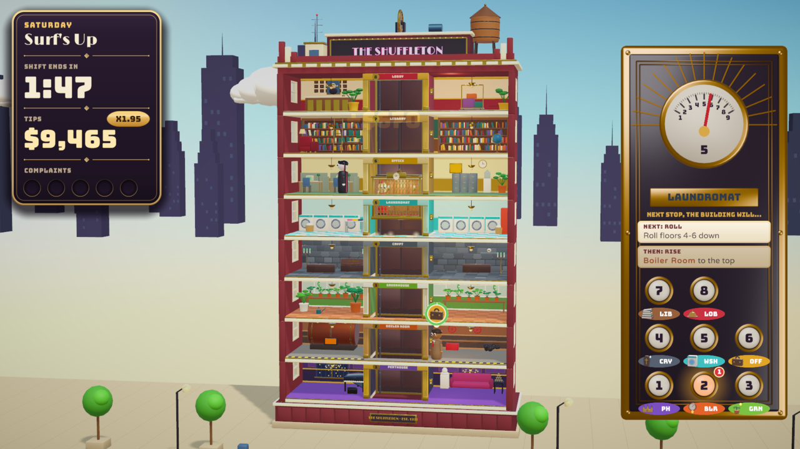

# One More Floor

**You run the elevator in The Shuffleton, a hotel that rearranges its floors every time you stop.**
Get a vampire, a houseplant, a kid who pressed every button and a soaked swimmer ("Lobby, please.")
where they're going before they lose their patience.

A short-shift score-attack game made in **Unity 6.6 (URP)**. Every model was built by script in
**Blender 4.5**, and all the music and sound was synthesized from scratch in Python. Ten floors,
eight kinds of guest, ten shifts of two to three minutes, plus an endless Overtime.




## Playing

```sh
Tools/play.sh            # runs Builds/Linux/OneMoreFloor.x86_64 (uses native Wayland when available)
```

The build lives in `Builds/Linux/`. Copy that whole folder to move the game elsewhere.

### Controls

| Input | Action |
| --- | --- |
| **Click a waiting guest** (at the floor the car is docked at) | Let them in |
| **Space** | Let in everyone who fits |
| **Click a floor** in the tower, **click a panel button**, or press **1–9** | Send the car there (you can redirect mid-trip) |
| **Click a guest in the car** (while docked) | Let them off here to wait. Useful for capacity and conflicts. |
| **Click a guest on another floor** | Send the car to them |
| **Hover** a guest or floor | Highlights where they're going, or who wants to go there |
| **Esc / P** | Pause (Resume, Restart, Settings, Quit to roster) |
| **Enter / Esc** in menus | Confirm / back |

## Rules

- **Every time the car stops, the building shuffles** using the next card in the forecast on the
  panel: two floors **swap**, a floor **rises** to the top or **sinks** to the bottom, a block
  **rolls**, or (late in the week) a block **flips**. Some cards are **calm**.
- **The floor you're docked at can't move.** A card that names it **jams**, so docking at a floor is
  how you protect it.
- The car holds **4 spaces**. Each guest has a **patience ring**. Run out while waiting and they
  storm off to the stairs; run out while riding and they leave, fuming, at the next stop. Either way
  that's a **complaint**. **Five complaints and you're fired**, which ends the shift (you keep your
  score).
- **Tips** are fare + patience left × your **streak** (+5% per delivery, up to ×2.5; any complaint
  resets it) × **group drops** (+25% for each extra guest delivered at the same stop). The last 30
  seconds are **Rush Hour**, worth ×1.5.
- Stars come from your tips. **One star unlocks the next shift.**

### The guests

| Guest | Rule |
| --- | --- |
| **Commuter** | Just wants their floor. |
| **Houseplant** | Won't get off until the doors have opened on a **sunny** floor (Greenhouse or Ocean). Wilts fast in the car. |
| **Mirror Mover** | Takes **two spaces**. Won't ride with a vampire. |
| **Vampire** | Won't ride with a mirror. If the doors open on **sunlight**, it turns into bats. |
| **Courier** | Their floor is **leaving the building** (watch the countdown sign). Get there before it goes. |
| **Swimmer** | Waits on the **Ocean**, which only visits for a few stops. Always "Lobby, please." |
| **Kid** | Pressed every button: the car **stops at every floor on the way**, sunny ones included. |
| **Tycoon** | **Express only**: stop anywhere else first and the tip is gone. Pays the most. |

### The floors

Lobby, Office, Library, Laundromat, Boiler Room, Greenhouse ☀, Penthouse, Crypt, Daycare, and
the **Ocean** ☀, which isn't really a floor. It barges into the building, replacing whichever
floor just left, then the tide goes out.

### The week

| # | Shift | New |
| --- | --- | --- |
| 1 | Monday: First Day | Commuters, swaps. A guided first shift; the clock starts after your first drop-off. |
| 2 | Tuesday: Green Thumb | Houseplant + Greenhouse |
| 3 | Wednesday: Heavy Lifting | Mirror Mover + Penthouse, Rise/Sink cards |
| 4 | Thursday: Fangs for Nothing | Vampire + Crypt, Roll cards (dusk) |
| 5 | Friday: Special Delivery | Courier, floors leaving the building |
| 6 | Saturday: Surf's Up | The Ocean + Swimmer (the doors open onto the ocean) |
| 7 | Sunday: Family Day | Kid + Daycare |
| 8 | Monday Again: Board Meeting | Tycoon |
| 9 | Friday the 13th: Graveyard Shift | Everyone, Flip cards, night. Finishing it plays the ending. |
| 10 | Overtime | Endless; it gets busier until five complaints |

Each shift opens with a sticky note from The Management and a "New today" card. The first time a
rule matters in play, a one-line tip points at it.

## How it was made

### Project layout

```
Assets/
  Scripts/Core/          pure C# game rules (no UnityEngine): building + shuffle cards, car motion,
                         passengers, scoring, spawn director, scripted beats, the bot player
  Scripts/Game/          Unity presentation: GameRoot (bootstrap/flow), ShiftRunner (sim -> views,
                         input), BuildingView/FloorView/CarView/PassengerView, CameraRig, Sky, Fx,
                         ModelLibrary (rebuilds materials from names), Shots (headless captures)
  Scripts/Game/UI/       HUD, operator panel, bubbles, coach, menus (title, roster, intro, pause,
                         settings, results, ending), widgets
  Scripts/Game/Audio/    AudioDirector: synced music stems, reactive mix, pooled SFX
  Scripts/Game/Automation/AutoPilot.cs   self-test for the built game
  Shaders/OmfSky.shader  gradient skybox
  Tests/EditMode/        rule tests, determinism, "every shift is beatable", random-input fuzz
  Editor/                ProjectSetup, BuildScript, import settings
  Resources/             Models (FBX), Icons, Audio, Fonts (OFL), template materials
ArtSource/               Blender generators (+ saved .blend files)
  omf_lib.py             primitives authored in Unity space, material-name convention, FBX export
  build_floors.py        the ten floor modules        build_characters.py  the nine characters
  build_props.py         car, shaft, roof, street, skyline, FX meshes
  build_icons.py         floor icons, rule badges, character portraits
Tools/
  unity.sh               editor launcher (+ build-linux, test, batch)
  play.sh / autopilot.sh run / self-test the build
  sim.sh + simharness/   the rules on .NET outside Unity: balance tables, star suggestions, traces, fuzz
  synth/                 audio generator (numpy): dsp.py, make_sfx.py, make_music.py
  shot.sh, sheet.py      headless editor screenshots and contact sheets
docs/PLAN.md             the design and technical plan
```

The `Main` scene contains a single bootstrap object, and everything else is built at runtime.
Gameplay lives in `ShiftSim`, which is deterministic for a seed. The game, the bot, the tests and
the balance harness all drive that same object.

### Rebuilding things

```sh
# Models (writes Assets/Resources/Models/*.fbx and ArtSource/blend/*.blend)
blender -b -P ArtSource/build_floors.py   [-- --only Lobby,Ocean --preview /tmp/prev]
blender -b -P ArtSource/build_characters.py
blender -b -P ArtSource/build_props.py
blender -b -P ArtSource/build_icons.py

# Audio (writes Assets/Resources/Audio/{Sfx,Music}; Blender's Python ships numpy)
blender -b --python-exit-code 1 -P Tools/synth/make_audio.py -- [sfx] [music]

# Unity
Tools/unity.sh batch OneMoreFloor.EditorTools.ProjectSetup.Apply   # player/URP/fonts/scene setup
Tools/unity.sh build-linux                                          # Builds/Linux/OneMoreFloor.x86_64
Tools/unity.sh test                                                 # EditMode tests -> Logs/test-results.xml
```

On this machine the editor needs `libxml2.so.2`. `Tools/unity.sh` points the loader at a copy in
`Tools/.libs/` (gitignored); `sudo pacman -S libxml2-legacy` is the proper fix. TextMeshPro's
essential resources are committed (extracted with `Tools/extract_unitypackage.py`, because package
import is asynchronous in batch mode).

### Verification

- `Tools/sim.sh fuzz` runs random commands against every shift and checks invariants (capacity,
  bookkeeping, no vampire riding with a mirror, the car staying in the shaft).
- `Tools/sim.sh balance [seeds]` has four bot skill levels (novice, sloppy, decent, strong) play
  every shift. `Tools/sim.sh stars` suggests star thresholds from those runs; the catalog uses them.
- EditMode tests (`Tools/unity.sh test`) cover every rule, determinism, a random-input fuzz, and
  **every shift is beatable** (a decent bot reaches ≥1★ on every seed, and a strong bot reaches 3★).
- `Tools/autopilot.sh` launches the **built game**, walks the menus, plays all ten shifts with the
  bot through the full presentation, saves screenshots, and fails on any logged error or exception.

## Honest notes and limitations

- **I couldn't listen to the audio.** The music and effects were designed with standard synthesis
  recipes and checked numerically (levels, clipping, spectral balance, seamless loop points,
  spectrograms), but nobody has auditioned the mix by ear. It may need level or tone tweaks.
- **Feel was tuned without hands-on play.** I had no way to play in real time with a mouse, so the
  timings, difficulty and star thresholds come from frame-by-frame reviews and bot simulations
  calibrated to plausible human reaction times. The first real playtests will probably move the
  numbers.
- **Characters aren't rigged.** All animation is procedural (hops, squash and stretch, head shakes,
  drooping leaves, flapping capes, bobbing balloons), which suits the peg-doll style but there's no
  walk cycle.
- Gamepad input isn't supported (mouse and keyboard only).
- The game shows the whole tower at once. At nine floors the guests are small (about 50–60 px tall
  at 1080p), and bubbles can crowd when a queue is long.

## Credits

Design, code, models, music and sound were made for this project. Fonts are used under the SIL Open
Font License (license texts in `Assets/Resources/Fonts/`): **Limelight** (Sorkin Type), **Bungee**
(David Jonathan Ross), **Varela Round** (Joe Prince), **Patrick Hand** (Patrick Wagesreiter). Built
with Unity 6.6 and Blender 4.5.
