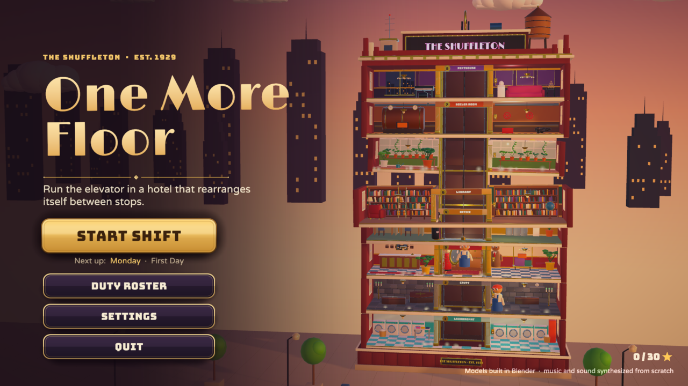
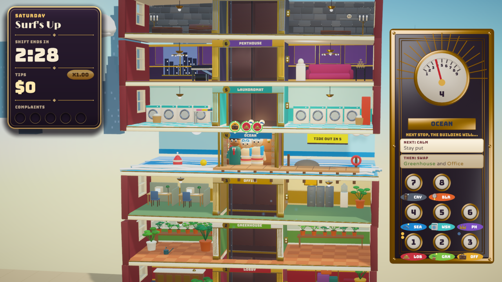
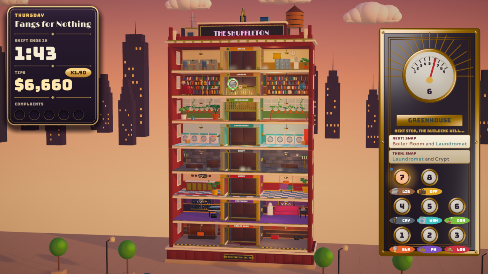
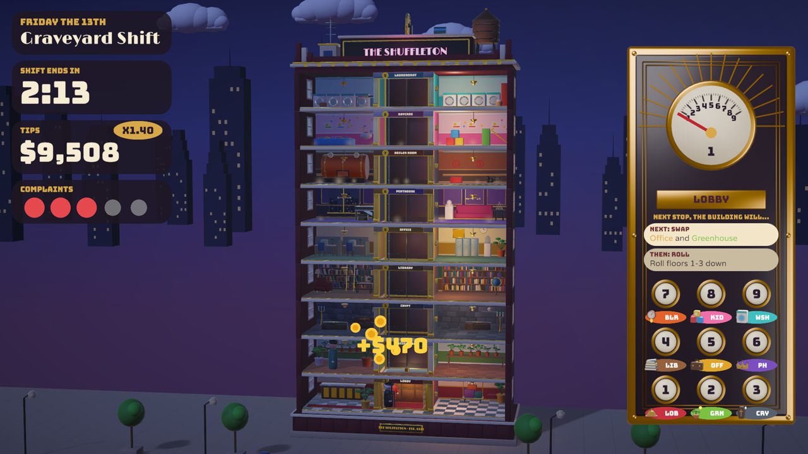
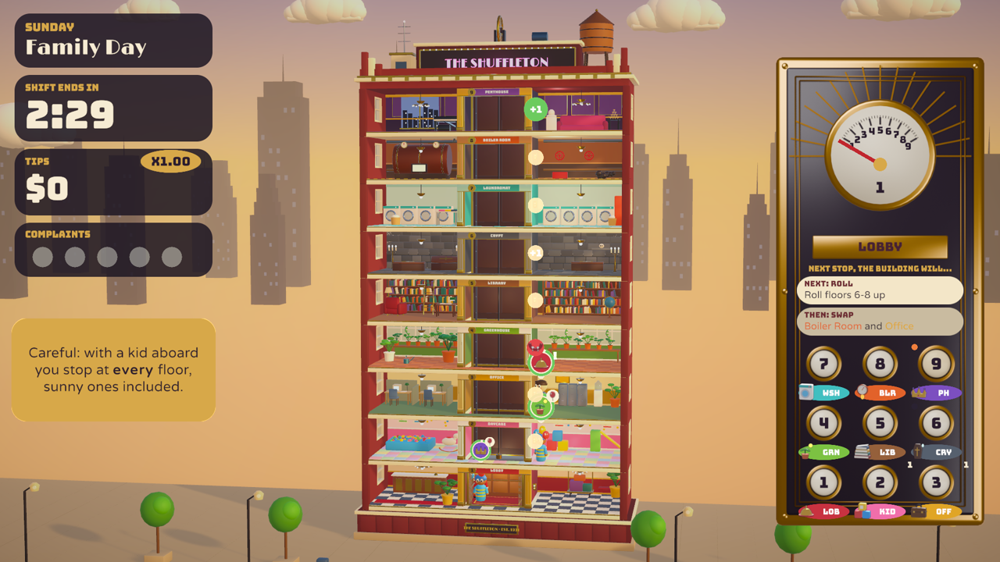
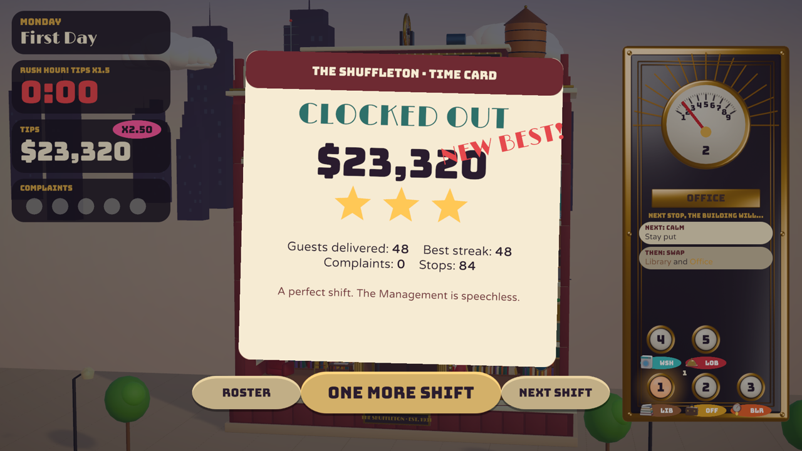
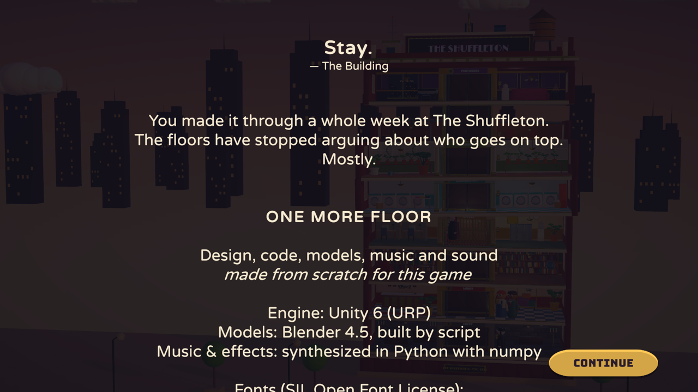
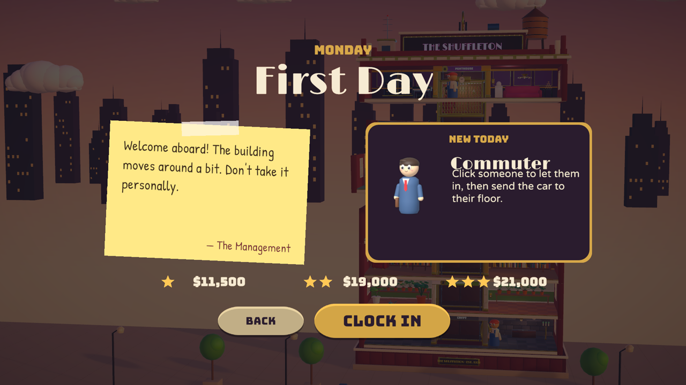

# One More Floor

**You run the elevator in The Shuffleton, a hotel that rearranges its floors every time you stop.**
Get a vampire, a houseplant, a kid who pressed every button and a soaked swimmer ("Lobby, please.")
where they're going before they lose their patience.

A short-shift score-attack game made in **Unity 6.6 (URP)**. Every model was built by script in
**Blender 4.5**, and all the music and sound was synthesized from scratch in Python. Ten floors,
eight kinds of guest, ten shifts of two to three minutes, plus an endless Overtime.

| | |
| --- | --- |
|  |  |
|  |  |
|  |  |
|  |  |

## Playing

```sh
Tools/play.sh            # runs Builds/Linux/OneMoreFloor.x86_64 (uses native Wayland when available)
```

The build lives in `Builds/Linux/`. Copy that whole folder to move the game elsewhere.

### Controls

| Input | Action |
| --- | --- |
| **Click a waiting guest** (at the floor the car is docked at) | Let them in |
| **Space** | Let in everyone who fits |
| **Click a floor** in the tower, **click a panel button**, or press **1–9** | Send the car there (you can redirect mid-trip) |
| **Right-click a guest in the car** (while docked) | Let them off here to wait. Useful for capacity and conflicts. |
| **Click a guest in the car** | Send the car to their floor |
| **Click a guest on another floor** | Send the car to them |
| **Hover** a guest or floor | Highlights where they're going. Hovering a destination previews the trip: every stop on the way (with a kid aboard), sunlight danger for vampires, sun for plants, and how many get off |
| **Scroll wheel**, **Z** (toggle), **− / =** | Zoom between the whole tower and a close-up that follows the car. Floors out of view with guests waiting show at the screen edge; click one to send the car there |
| **Esc / P** | Pause (Resume, Restart, Settings, Quit to roster) |
| **Enter / Esc** in menus | Confirm / back (arrow keys move a focus ring) |

**Gamepad** (or arrow keys, no mouse needed):

| Pad | Keys | Action |
| --- | --- | --- |
| **D-pad / left stick** up/down | **Up / Down** | Pick a floor (gold brackets). Shows the route preview |
| **D-pad** left/right, **LB / RB** | **Left / Right**, **Q / E** | Pick a guest on that floor or in the car (shows their card) |
| **A** | **Enter** | Send the car to the floor, let the picked guest in, or go and get them. When the car is already open there, everyone fitting gets in |
| **X** | **F** | Let the picked rider off here |
| **Y** | **Space** | Let everyone in |
| **B** | **Backspace** | Unpick the guest |
| **RT / LT**, right stick | | Zoom in / out |
| **Start** | **Esc** | Pause / resume |

A strip at the bottom shows what each button will do right now. In menus the d-pad moves a focus ring, A
confirms, B goes back, and left/right adjusts sliders and switches.

## Rules

- **Every time the car stops, the building shuffles** using the next card in the forecast on the
  panel: two floors **swap**, a floor **rises** to the top or **sinks** to the bottom, a block
  **rolls**, or (late in the week) a block **flips**. Some cards are **calm**.
- **The floor you're docked at can't move.** A card that names it **jams**, so docking at a floor is
  how you protect it.
- The car holds **4 spaces**. Each guest has a **patience ring**. Run out while waiting and they
  storm off to the stairs; run out while riding and they leave, fuming, at the next stop. Either way
  that's a **complaint**. **Five complaints and you're fired**, which ends the shift (you keep your
  score).
- **Tips** are fare + patience left × your **streak** (+5% per delivery, up to ×2.5; any complaint
  resets it) × **group drops** (+25% for each extra guest delivered at the same stop). The last 30
  seconds are **Rush Hour**, worth ×1.5.
- Stars come from your tips. **One star unlocks the next shift.** The thresholds are tuned so that about
  half of first attempts earn the star, so most players unlock the next shift in a try or two (see
  [Balance](#balance)).

### The guests

| Guest | Rule |
| --- | --- |
| **Commuter** | Just wants their floor. |
| **Houseplant** | Won't get off until the doors have opened on a **sunny** floor (Greenhouse or Ocean). Wilts fast in the car. |
| **Mirror Mover** | Takes **two spaces**. Won't ride with a vampire. |
| **Vampire** | Won't ride with a mirror. If the doors open on **sunlight**, it turns into bats. |
| **Courier** | Their floor is **leaving the building** (watch the countdown sign). Get there before it goes. |
| **Swimmer** | Waits on the **Ocean**, which only visits for a few stops. Always "Lobby, please." |
| **Kid** | Pressed every button: the car **stops at every floor on the way**, sunny ones included. |
| **Tycoon** | **Express only**: stop anywhere else first and the tip is gone. Pays the most. |

### The floors

Lobby, Office, Library, Laundromat, Boiler Room, Greenhouse ☀, Penthouse, Crypt, Daycare, and
the **Ocean** ☀, which isn't really a floor. It barges into the building, replacing whichever
floor just left, then the tide goes out.

### The week

| # | Shift | New |
| --- | --- | --- |
| 1 | Monday: First Day | Commuters, swaps. A guided first shift; the clock starts after your first drop-off. |
| 2 | Tuesday: Green Thumb | Houseplant + Greenhouse |
| 3 | Wednesday: Heavy Lifting | Mirror Mover + Penthouse, Rise/Sink cards |
| 4 | Thursday: Fangs for Nothing | Vampire + Crypt, Roll cards (dusk) |
| 5 | Friday: Special Delivery | Courier, floors leaving the building |
| 6 | Saturday: Surf's Up | The Ocean + Swimmer (the doors open onto the ocean) |
| 7 | Sunday: Family Day | Kid + Daycare |
| 8 | Monday Again: Board Meeting | Tycoon |
| 9 | Friday the 13th: Graveyard Shift | Everyone, Flip cards, night. Finishing it plays the ending. |
| 10 | Overtime | Endless; it gets busier until five complaints |

Each shift opens with a sticky note from The Management and a "New today" card. The first time a
rule matters in play, a one-line tip points at it.

## How it was made

### Project layout

```
Assets/
  Scripts/Core/          pure C# game rules (no UnityEngine): building + shuffle cards, car motion,
                         passengers, scoring, spawn director, scripted beats, the bot player
  Scripts/Game/          Unity presentation: GameRoot (bootstrap/flow), ShiftRunner (sim -> views,
                         input), BuildingView/FloorView/CarView/PassengerView, CharacterRig (blends
                         the Blender clips with Playables), CameraRig (framing, zoom, follow), Controls
                         (mouse/pad/keys), Telemetry (local playtest log), Sky, Fx, ModelLibrary
                         (rebuilds materials from names), Shots (headless captures)
  Scripts/Game/UI/       HUD, operator panel, bubbles, coach, menus (title, roster, intro, pause,
                         settings, results, ending), widgets, UiNav (gamepad/arrow focus ring),
                         HudCursor (pad cursor, button prompts, off-screen floor indicators), Deco (the
                         Art Deco look: enamel panels, brass frames, gold/enamel buttons and gilded
                         type, painted at startup)
  Scripts/Game/Audio/    AudioDirector: synced music stems, reactive mix, pooled SFX
  Scripts/Game/Automation/AutoPilot.cs   self-test for the built game
  Scripts/Game/Automation/DemoReel.cs    scripted, self-recording gameplay demo
  Scripts/Game/Automation/PadSim.cs      virtual gamepad for the autopilot
  Shaders/OmfSky.shader  gradient skybox
  Tests/EditMode/        rule tests, determinism, "every shift is beatable", random-input fuzz
  Editor/                ProjectSetup, BuildScript, import settings
  Resources/             Models (FBX), Icons, Audio, Fonts (OFL), template materials
ArtSource/               Blender generators (+ saved .blend files)
  omf_lib.py             primitives authored in Unity space, material-name convention, FBX export
  build_floors.py        the ten floor modules        build_characters.py  the nine characters
  char_rig.py            armatures, skin weights and the animation clips (Idle, Walk, Stomp, Tap, Cheer, Tuck,
                         Fume; Salute and Worry for the bellhop)
  build_props.py         car, shaft, roof, street, skyline, FX meshes
  build_icons.py         floor icons, rule badges, character portraits
Tools/
  unity.sh               editor launcher (+ build-linux, test, batch)
  play.sh / autopilot.sh run / self-test the build
  sim.sh + simharness/   the rules on .NET outside Unity: balance tables, star suggestions, traces, fuzz
  synth/                 audio generator (numpy): dsp.py, make_sfx.py, make_music.py; audit.py (objective
                         audio checks)
  playtest_report.py     summarises real playtest logs, suggests star thresholds
  shot.sh, sheet.py      headless editor screenshots and contact sheets
  gallery.sh             every menu screen in one play session (throwaway save)
  uicheck.sh             hit-tests every visible button, slider and toggle on each menu
  demo.sh                records the demo video from the build (see below)
docs/PLAN.md             the design and technical plan
```

The `Main` scene contains a single bootstrap object, and everything else is built at runtime.
Gameplay lives in `ShiftSim`, which is deterministic for a seed. The game, the bot, the tests and
the balance harness all drive that same object.

### Rebuilding things

```sh
# Models (writes Assets/Resources/Models/*.fbx and ArtSource/blend/*.blend)
blender -b -P ArtSource/build_floors.py   [-- --only Lobby,Ocean --preview /tmp/prev]
blender -b -P ArtSource/build_characters.py   [-- --only Kid --pose-preview /tmp/poses]   # rigged + animated
blender -b -P ArtSource/build_props.py
blender -b -P ArtSource/build_icons.py

# Audio (writes Assets/Resources/Audio/{Sfx,Music}; Blender's Python ships numpy)
blender -b --python-exit-code 1 -P Tools/synth/make_audio.py -- [sfx] [music]
blender -b --python-exit-code 1 -P Tools/synth/audit.py [-- --mix capture.wav]   # objective audio checks

# Unity
Tools/unity.sh batch OneMoreFloor.EditorTools.ProjectSetup.Apply   # player/URP/fonts/scene setup
Tools/unity.sh build-linux                                          # Builds/Linux/OneMoreFloor.x86_64
Tools/unity.sh test                                                 # EditMode tests -> Logs/test-results.xml
```

On this machine the editor needs `libxml2.so.2`. `Tools/unity.sh` points the loader at a copy in
`Tools/.libs/` (gitignored); `sudo pacman -S libxml2-legacy` is the proper fix. TextMeshPro's
essential resources are committed (extracted with `Tools/extract_unitypackage.py`, because package
import is asynchronous in batch mode).

### Verification

- `Tools/sim.sh fuzz` runs random commands against every shift and checks invariants (capacity,
  bookkeeping, no vampire riding with a mirror, the car staying in the shaft).
- `Tools/sim.sh balance [seeds]` has four bot skill levels (novice, sloppy, decent, strong) play
  every shift. `Tools/sim.sh stars` suggests star thresholds from those runs; the catalog uses them.
- EditMode tests (`Tools/unity.sh test`) cover every rule, determinism, a random-input fuzz, and
  **every shift is beatable** (a decent bot reaches ≥1★ on every seed, and a strong bot reaches 3★).
- `Tools/autopilot.sh` launches the **built game**, walks the menus, plays all ten shifts with the
  bot through the full presentation, saves screenshots, and fails on any logged error or exception.
  It also logs average fps. It then drives the menus and a shift with a **virtual gamepad**: focus
  ring, back, floor cursor, send, zoom, and pause/resume. `Tools/autopilot.sh <dir> pad` runs only
  that part.
- `Unity: OneMoreFloor.EditorTools.RigCheck.Sheet("Kid", "/tmp/kid.png")` renders every imported clip of
  a character at four moments, to check the rigs after a Blender re-export.
- `Tools/synth/audit.py` checks every sound objectively:
  - per file: BS.1770 loudness, 4× oversampled true peak, DC, clicks at either end, loop seams,
    leading silence (which reads as lag), spectral balance and stereo correlation;
  - every `Sfx`/`Voice` call in the code at the volume it's played, against its category;
  - with `--mix`, a recording of the final in-game mix.

  It found and fixed: clicks at the start of nine sounds, music that clipped between samples, a DC
  offset, a rumble small speakers couldn't play, voice variants 6 LU apart, and a countdown tick too
  quiet for its job.
- `-omfPerf <shift> [-omfNoVsync]` plays a shift for 30 s and logs frame-time percentiles. Graveyard
  Shift (nine floors, rigged guests, 1600×900) measured 293 fps uncapped (p95 5 ms) on this machine.
  The machine was shared with other heavy jobs (load average 20–50), so repeat runs vary a lot.
  `-omfNoRig` leaves characters unanimated for A/B runs; it showed no measurable cost from the rigs.
  Normally the game is capped to the display refresh rate.
- `-omfRecordAudio <file.wav>` records the final mix the player hears. `audit.py --mix` measures it:
  a recorded Saturday came out at -15.4 LUFS integrated, -1.3 dBTP true peak and a 10.5 LU loudness
  range. A lookahead limiter holds the peak at its ceiling without clipping.

### Demo video

`Tools/demo.sh [out.mp4]` records a 1½-minute demo video from the built game (defaults to
`Builds/Demo/OneMoreFloor-demo.mp4`; it takes about 4 minutes). It covers the menus, about a minute
of Saturday played by the strong bot with a visible cursor and short captions, then the results. The
game records itself twice from a fixed seed: once rendering frames offline at a steady 30 fps, and
once capturing the audio in real time. `ffmpeg` then joins the two. Both runs play out identically,
and the picture and sound line up to within about 20 ms. It uses a throwaway save.

### Balance

`Tools/sim.sh human` plays every shift with a **model of a person**: decision time, Fitts'-law pointer
travel for each click, a beat to take in each stop, and Space to board a whole queue. It does this at
three skill levels. The first balance pass, against bots that click instantly, was much too hard for
that model: an average player was fired on most runs from Thursday on. `Tools/sim.sh causes` showed
why (waiting storm-offs, plus swimmers and parcels lost to departing floors). `Tools/sim.sh pace`
found the gentlest pacing that keeps modelled average players employed. The current thresholds come
from the model's score percentiles:

| | New player | Average | Practised |
| --- | --- | --- | --- |
| 1★ (unlocks the next shift) | ~50% of first runs | 83–100% | 100% |
| 2★ | rare | ~40% | 79–96% |
| 3★ | — | rare | 25–50% |

Every shift a person plays is appended to a **local** log (`playtests.jsonl` next to the save; nothing
leaves the machine). `Tools/playtest_report.py` summarises the logs from any number of testers and
suggests new thresholds from real scores. It also compares measured reaction times with the model's
assumptions, so the next tuning pass can use people instead of the model.

## Honest notes and limitations

- **Nobody has listened to the audio.** The sound was designed with standard synthesis recipes and is
  checked objectively by `audit.py`: loudness, true peak, clicks, seams, latency, balance against its
  category, and the recorded in-game mix. That catches technical faults, but not whether something
  sounds good or gets annoying on the hundredth play. The first listening session will probably
  change some sounds.
- **Feel is modelled, not playtested.** The difficulty and thresholds are fitted to a human model, not
  to real people, and I couldn't play in real time myself. The model is grounded in standard
  human-factors numbers, but it plays smarter than a first-timer and has no learning curve. The
  playtest log and report are there so the first real sessions can correct it quickly.
- **The rigs are simple.** Characters have real armatures with skinned elbows and knees, and their
  clips are keyframed in Blender. There are no facial rigs, fingers or physics. Couriers, mirror
  movers and the kid's balloon arm hold their props, so those arms don't animate.
- **Gamepad support is tested with a virtual pad.** The autopilot drives every gamepad path through
  the Input System, but no physical controller has been tried. Glyphs are generic (A/B/X/Y) rather
  than per-brand.
- The whole tower at nine floors still makes guests small (about 50–60 px tall at 1080p). The
  close-up zoom roughly doubles that.

## Credits

Design, code, models, music and sound were made for this project. Fonts are used under the SIL Open
Font License (license texts in `Assets/Resources/Fonts/`): **Limelight** (Sorkin Type), **Bungee**
(David Jonathan Ross), **Varela Round** (Joe Prince), **Patrick Hand** (Patrick Wagesreiter). Built
with Unity 6.6 and Blender 4.5.
